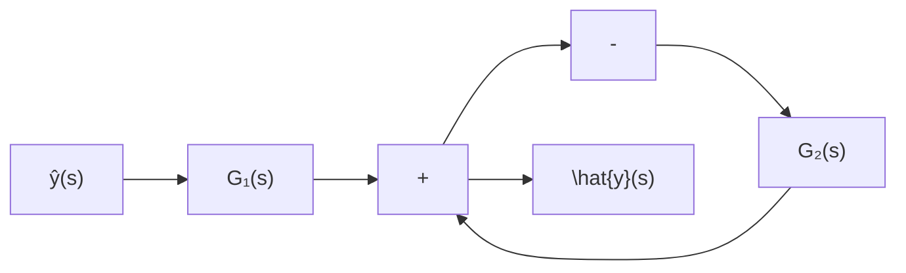

$$
\dot {\boldsymbol {x}} = \left[ \begin{array}{r r r} 8 & - 8 & - 2 \\ 4 & - 3 & - 2 \\ 3 & - 4 & 1 \end{array} \right] \boldsymbol {x} + \left[ \begin{array}{l l} 2 & 3 \\ 1 & 5 \\ 7 & 1 \end{array} \right] \boldsymbol {u} \tag {i}

\dot {\boldsymbol {x}} = \left[ \begin{array}{l l} 0 & 1 \\ - 9 & - 6 \end{array} \right] \boldsymbol {x} + \left[ \begin{array}{l} 4 \\ 2 \end{array} \right] u \tag {ii}
$$

1.12 计算下列状态空间描述的传递函数 $G(s)$ :

$$
\dot {x} = \left[ \begin{array}{c c} - 5 & - 1 \\ 3 & - 1 \end{array} \right] x + \left[ \begin{array}{l} 2 \\ 5 \end{array} \right] u
y = [ 1 \quad 2 ] x + 4 u
$$

1.13 给定系统的状态方程为:

$$
\left[ \begin{array}{l} \dot {x} _ {1} \\ \dot {x} _ {2} \\ \dot {x} _ {3} \end{array} \right] = \left[ \begin{array}{c c c} 0 & 2 & 0 \\ 0 & 0 & 2 \\ 1 & - 3 & 5 \end{array} \right] \left[ \begin{array}{l} x _ {1} \\ x _ {2} \\ x _ {3} \end{array} \right] + \left[ \begin{array}{l} 2 \\ 3 \\ 5 \end{array} \right] u.
$$

现取 $y = x_{2} + 3x_{3}$ ，列写出相应的输出 $y$ 一输入 $u$ 标量微分方程。

1.14 计算下列状态空间描述的传递函数矩阵 $G(s)$ :

$$
\begin{array}{l} \dot {\boldsymbol {x}} = \left[ \begin{array}{c c c} 0 & 1 & 0 \\ 0 & 0 & 1 \\ - 3 & - 1 & - 2 \end{array} \right] \boldsymbol {x} + \left[ \begin{array}{c c} 1 & 0 \\ 0 & 1 \\ 1 & 1 \end{array} \right] \boldsymbol {u} \\ y = [ 1 \quad 1 \quad 1 ] \boldsymbol {x} \end{array}
$$

1.15 给定同维的方阵 $A$ 和 $\tilde{A}$ 为

$$
A = \left[ \begin{array}{c c c c} 0 & 1 & & \\ \vdots & \ddots & & \\ \vdots & & \ddots & \\ 0 & & & 1 \\ \hline \alpha_ {0} & \alpha_ {1} & \dots & \alpha_ {s - 1} \end{array} \right], \tilde {A} = \left[ \begin{array}{c c c c} 0 & \dots & 0 & \alpha_ {0} \\ \hline 1 & & & \alpha_ {1} \\ & \ddots & & \vdots \\ & & 1 & \alpha_ {s - 1} \end{array} \right]
$$

试确定一个变换阵 P 使成立 $\tilde{A}=P^{-1}AP$ 。

1.16 给定方常阵 $A$ 为

$$
A = \left[ \begin{array}{c c c} 0 & 1 & 0 \\ 0 & 0 & 1 \\ - 6 & - 1 & 4 \end{array} \right]
$$

试计算 $A^{100}$ 。

1.17 设 $A$ 为方常阵, 定义以 $A$ 为幂的矩阵指数函数为

$$e ^ {A} \triangleq I + A + \frac {1}{2 !} A ^ {2} + \dots + \frac {1}{k !} A ^ {k} + \dots$$

现假定 A 的特征值 $\lambda_{1}, \lambda_{2}, \cdots, \lambda_{s}$ 为两两相异，试证明 $\det\left[e^{A}\right] = \prod_{i=1}^{n} e^{\lambda_{i}}$ 。

1.18 给定方常阵 $A$ 为

$$
A = \left[ \begin{array}{c c} 0 & 1 \\ - 2 & - 3 \end{array} \right]
$$

计算出 $e^{A}$ 的结果。

1.19 给定反馈系统如图 P1.6 所示, 其中

$$
G _ {1} (s) = \left[ \begin{array}{c c} \frac {1}{s + 1} & \frac {1}{s + 2} \\ 0 & \frac {s + 1}{s + 2} \end{array} \right], G _ {2} (s) = \left[ \begin{array}{c c} \frac {1}{s + 3} & \frac {1}{s + 4} \\ \frac {1}{s + 1} & 0 \end{array} \right]
$$

试确定反馈系统的传递函数矩阵 $G(s)$ 。

flowchart

图 P1.6

1.20 给定图 P1.6 的反馈系统, 其中

$$G _ {1} (s) = \frac {2 s + 1}{s (s + 1) (s + 3)}, G _ {2} (s) = \frac {s + 2}{s + 4}$$

试定出反馈系统的状态方程和输出方程。
