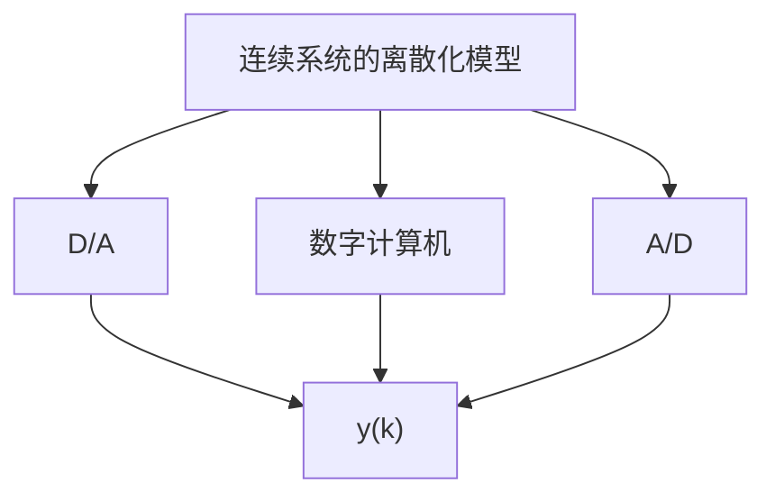

# 2.6 线性连续系统的时间离散化

问题的提出 无论是利用数字计算机分析连续时间系统，还是利用计算机等离散控制装置来控制连续时间受控系统时，都会遇到一个把连续时间系统化成为等价的离散时间系统的问题。

图 2.1 所示为将连续时间系统化为离散时间系统的一种典型情况。受控对象是一个连续时间系统，其状态 $x(t)$ 、输入 $u(t)$ 和输出 $y(t)$ 都是时间 t 的连续函数向量。控制装置由数模转换 $(D/A)$ 、数字计算机和模数转换 $(A/D)$ 所构成，它只能输入离散时间变量 $y(k)$ ，并输出离散时间变量 $u(k)$ ，其中离散时间序列 $k=0,1,2,\cdots$ 。为了使这两部分能


<details>
<summary>flowchart</summary>

```mermaid
graph TD
    A["保持器"] -->|u(t)| B["连续系统"]
    B -->|y(t)| C["采样器"]
    C -->|y(k)| D["数字计算机"]
    D -->|A/D| E["D/A"]
    E -->|x(k)| D
    D -->|u(k)| A
```
</details>

(a)


<details>
<summary>flowchart</summary>


</details>

(b)   
图2.1 连续系统时间离散化的一个例子

够联接起来，分别引入采样器和保持器。采样器的作用是把连续变量 $y(t)$ 转换成为离散变量 $y(k)$ ，常用的采样器是一种周期性动作的采样开关，当开关接通时将变量输入，而在开关断开时将变量阻断。保持器的作用则是把离散信号 $u(k)$ 变换为连续信号 $u(t)$ ，它是由电子元件组成的一种保持电路，可分为零阶保持器、一阶保持器等。这样，如果把保持器-连续系统-采样器看成为一个整体，并用 $x(k)$ 表示其离散状态向量，那么它就组成了以 $x(k), u(k)$ 和 $y(k)$ 为变量的离散时间系统，其状态空间描述即为连续系统的时间离散化模型。而控制装置所面对的正是这个离散化模型，其示意图如图2.1(b)所示。

线性连续系统的时间离散化问题的数学实质, 就是在一定的采样方式和保持方式下, 由系统的连续时间状态空间描述来导出其对应的离散时间状态空间描述, 并建立起两者的系数矩阵间的关系式。

三点基本假设 为使离散化后的描述具有简单的形式,并保证它是可复原的,我们先引入如下的三点基本假设:

① 采样器的采样方式取为以常数 T 为周期的等间隔采样。采样瞬时为 $t_{k}=kT$ ， $k=0,1,2,\cdots$ 。采样时间宽度 $\Delta$ 比之采样周期 T 要小很多，即 $\Delta\ll T$ ，因而可将其视为零。用 $y(t)$ 和 $y(k)$ 分别表示采样器的输入和输出信号，则在此假定下两者之间有如下的关系式

$$
\mathbf {y} (k) = \left\{ \begin{array}{l l} \mathbf {y} (t), & t = k T \\ \mathbf {0}, & t \neq k T \end{array} \right. \tag {2.133}
$$

其中 $k=0,1,2,\cdots$ 。这种采样方式的示意图如图 2.2 所示， $y_{i}(t)$ 和 $y_{i}(k)$ 分别为向量 $y(t)$ 和 $y(k)$ 的第 i 个分量， $i=1,2,\cdots,q$ 。


<details>
<summary>line</summary>

| t | y(t) | y(k) |
| --- | --- | --- |
| 0 |  |  |
| 2 |  |  |
| 4 |  |  |
| 6 |  |  |
| >6 |  |  |
</details>

图2.2 周期为 $T$ 的等间隔采样示意图

② 采样周期 $T$ 的值的确定要满足申农 (shannon) 采样定理所给出的条件。设连续信号 $y_{i}(t)$ 的幅频谱 $\left|Y_{i}(j\omega)\right|$ 如图2.3所示，它是对称于纵坐标轴的， $\omega_{c}$ 为其上限频率。

那么，申农采样定理指出：离散信号 $y_{i}(k)$ 可以完满地复原为原来的连续信号 $y_{i}(t)$ 的条件为采样频率 $\omega_{i}$ 满足如下的不等式：

$$\omega_ {s} > 2 \omega_ {e} \tag {2.134}$$
