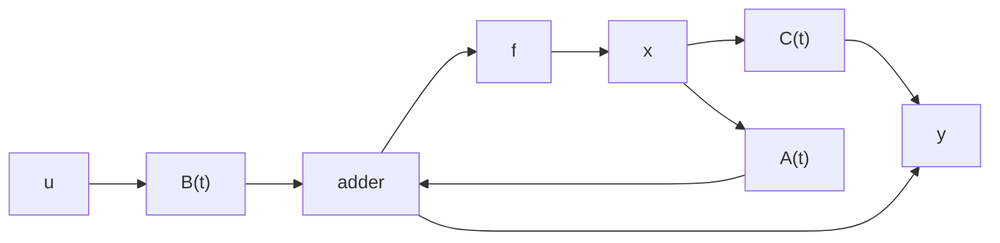

# 3.4 对偶性原理

从前面各节的讨论中可以看出,能控性和能观测性,无论在概念上还是在判据的形式上都是对偶的。这种内在的对偶关系反映了系统的控制问题和估计问题间的对偶性。本节中,我们要介绍表征这种对偶关系的规律性结果,即对偶性原理。

对偶系统 考察线性时变系统 $\Sigma$ :

$$\dot {\boldsymbol {x}} = A (t) \boldsymbol {x} + B (t) \boldsymbol {u} \tag {3.102}\mathbf {y} = C (t) \mathbf {x}$$

其中，状态 x、输入 u 和输出 y 分别为 $n \times 1, p \times 1$ 和 $q \times 1$ 的列向量。则定义如下构成的线性时变系统 $\Sigma_{d}$ :

$$\dot {\boldsymbol {\psi}} ^ {T} = - A ^ {T} (t) \boldsymbol {\psi} ^ {T} + C ^ {T} (t) \boldsymbol {\eta} ^ {T} \tag {3.103}\boldsymbol {\varphi} ^ {T} = B ^ {T} (t) \boldsymbol {\psi} ^ {T}$$

为系统（3.102）的对偶系统，其中协状态 $\pmb{\psi}$ 、输入 $\pmb{\eta}$ 和输出 $\pmb{\varphi}$ 分别为 $1\times n,1\times q$ 和 $1\times p$ 的行向量。对于线性定常系统

$$\dot {\boldsymbol {x}} = A \boldsymbol {x} + B \boldsymbol {u} \tag {3.104}\mathbf {y} = C \mathbf {x}$$

则相应地其对偶系统为

$$\dot {\boldsymbol {\psi}} ^ {T} = - A ^ {T} \boldsymbol {\psi} ^ {T} + C ^ {T} \boldsymbol {\eta} ^ {T} \tag {3.105}\boldsymbol {\varphi} ^ {T} = B ^ {T} \boldsymbol {\psi} ^ {T}$$

线性系统 $\Sigma$ 和其对偶系统 $\Sigma_{d}$ 之间有着如下的一些对应关系。

(1) 令 $\Phi(t, t_0)$ 为系统(3.102)的状态转移矩阵, $\Phi_d(t, t_0)$ 为其对偶系统的状态转移矩阵, 则必成立

$$\Phi_ {d} (t, t _ {0}) = \Phi^ {T} (t _ {0}, t) \tag {3.106}$$

我们来证明(3.106)。考虑到 $\Phi(t, t_0)\Phi^{-1}(t, t_0) = I$ ，于是将其对 $t$ 求导可得

$$
\begin{array}{l} 0 = \frac {d}{d t} [ \Phi (t, t _ {0}) \Phi^ {- 1} (t, t _ {0}) ] = \frac {d}{d t} [ \Phi (t, t _ {0}) ] \Phi^ {- 1} (t, t _ {0}) \\ + \Phi (t, t _ {0}) \frac {d}{d t} [ \Phi^ {- 1} (t, t _ {0}) ] = A (t) \Phi (t, t _ {0}) \Phi^ {- 1} (t, t _ {0}) \\ + \Phi (t, t _ {0}) \dot {\Phi} (t _ {0}, t) = A (t) + \Phi (t, t _ {0}) \dot {\Phi} (t _ {0}, t) \tag {3.107} \\ \end{array}
$$

从而，由此即可导出

$$\dot {\Phi} \left(t _ {0}, t\right) = - \Phi \left(t _ {0}, t\right) A (t), \Phi \left(t _ {0}, t _ {0}\right) = I \tag {3.108}$$

或

$$\dot {\Phi} ^ {T} \left(t _ {0}, t\right) = - A ^ {T} (t) \Phi^ {T} \left(t _ {0}, t\right), \Phi^ {T} \left(t _ {0}, t _ {0}\right) = I \tag {3.109}$$

这表明式(3.106)成立。

(2) 系统 (3.102) 和其对偶系统 (3.103) 的方块图是对偶的, 如图 3.3 所示。

flowchart

flowchart

