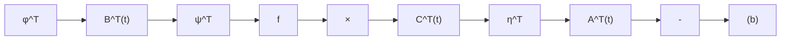

图 3.3 线性时变系统 (a) 及其对偶系统 (b)

(3) 系统 (3.102) 的运动是状态点在状态空间中由 $t_0$ 至 $t$ 的正时向转移, 而对偶系统的运动是协状态点在状态空间中由 $t$ 至 $t_0$ 的反时向转移。

对偶性原理 系统 $\Sigma$ 和其对偶系统 $\Sigma_{d}$ 在能控性和能观测性上具有下述结论中所指出的对应关系：

结论 $\Sigma$ 的完全能控等同于 $\Sigma_{d}$ 的完全能观测， $\Sigma$ 的完全能观测等同于 $\Sigma_{d}$ 的完全能控。

证 设 $\Sigma$ 在时刻 $t_0$ 为完全能控，则意味着存在有限时刻 $t_1 > t_0$ 使成立

$$
n = \operatorname{rank} \left[ \int_ {t _ {0}} ^ {t _ {1}} \Phi (t _ {0}, t) B (t) B ^ {T} (t) \Phi^ {T} (t _ {0}, t) d t \right]
\begin{array}{l} = \operatorname{rank} \left[ \int_ {t _ {0}} ^ {t _ {1}} \left[ \Phi^ {T} (t _ {0}, t) \right] ^ {T} \left[ B ^ {T} (t) \right] ^ {T} \left[ B ^ {T} (t) \right] \left[ \Phi^ {T} (t _ {0}, t) \right] d t \right] \\ = \operatorname{rank} \left[ \int_ {t _ {0}} ^ {t _ {1}} \Phi_ {d} ^ {T}: (t, t _ {0}) [ B ^ {T} (t) ] ^ {T} [ B ^ {T} (t) ] \Phi_ {d} (t, t _ {0}) d t \right] \tag {3.110} \\ \end{array}
$$

这表明它等同于 $\Sigma_{d}$ 在时刻 $t_{0}$ 为完全能观测。利用类同的推导过程，还可证明 $\Sigma$ 在时刻 $t_{0}$ 的完全能观测等同于 $\Sigma_{d}$ 在时刻 $t_{0}$ 的完全能控。从而，证明完成。

对偶性原理的意义，不仅在于提供了由一种结构特性(如能控性)的判据来导出另一种结构特性(如能观测性)的判据的途径，而且还在于建立了系统的控制问题和估计问题的基本结论间的对应关系。这既具有理论上的重要性，也具有应用上的实际价值。
