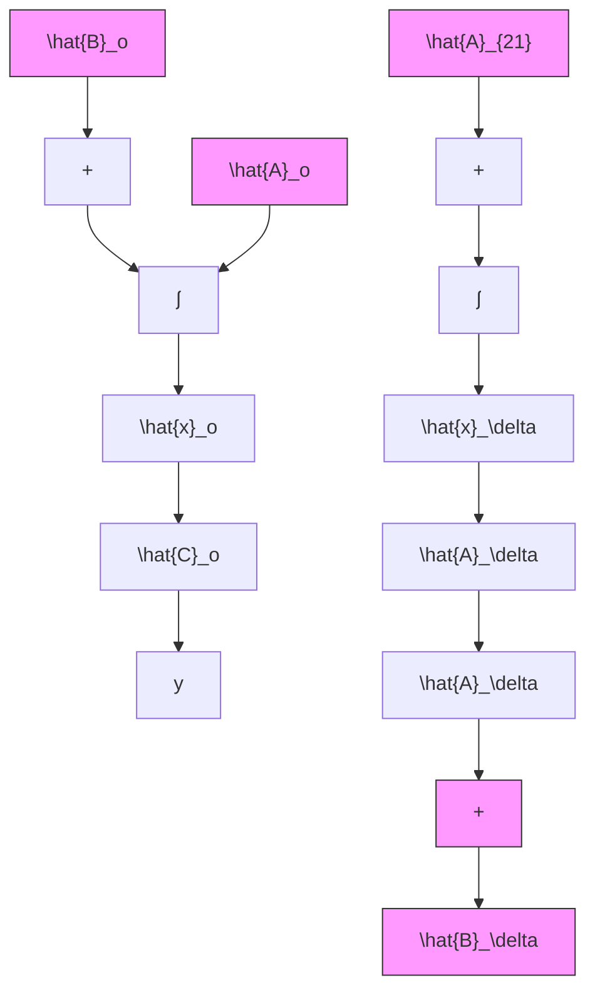

$$
\left[ \begin{array}{l} \dot {\hat {x}} _ {o} \\ \dot {\hat {x}} _ {s} \end{array} \right] = \left[ \begin{array}{c c} \hat {A} _ {o} & 0 \\ \hat {A} _ {2 1} & \hat {A} _ {s} \end{array} \right] \left[ \begin{array}{l} \hat {x} _ {o} \\ \hat {x} _ {s} \end{array} \right] + \left[ \begin{array}{l} \hat {B} _ {o} \\ \hat {B} _ {s} \end{array} \right] u \tag {3.254}

\boldsymbol {y} = \left[ \begin{array}{l l} \hat {C} _ {o} & 0 \end{array} \right] \left[ \begin{array}{l} \hat {\boldsymbol {x}} _ {o} \\ \hat {\boldsymbol {x}} _ {\delta} \end{array} \right]
$$

其中， $\hat{x}_0$ 为 $m$ 维能观测分状态， $\hat{x}_s$ 为 $n - m$ 维不能观测分状态。

从上述基本结论可以看出,系统在分解后所得到的能观测部分是m维子系统

$$
\begin{array}{l} \dot {\hat {x}} _ {o} = \hat {A} _ {o} \hat {x} _ {o} + \hat {B} _ {o} u \\ y _ {1} = \hat {C} _ {o} \hat {x} _ {o} \tag {3.255} \\ \end{array}
$$

不能观测部分为 $n - m$ 维子系统

$$
\begin{array}{l} \dot {\hat {x}} _ {o} = \hat {A} _ {o} \hat {x} _ {o} + \hat {A} _ {2 1} \hat {x} _ {o} + \hat {B} _ {s} u \\ \mathcal {Y} _ {2} = 0 \tag {3.256} \\ \end{array}
$$

其中 $y = y_1$ 。而且，这种分解只是在 (3.254) 的形式意义下是唯一的。相应的分解后的方块图如图 3.7 所示。

线性定常系统结构的规范分解 考虑同时为不完全能控和不完全能观测的线性定常系统

$$
\begin{array}{l} \dot {x} = A x + B u \\ \mathbf {y} = C \mathbf {x} \tag {3.257} \\ \end{array}
$$

flowchart

图 3.7 系统按能观测性分解后的方块图

那么，合并上述两部分的结果，即可得到系统同时按能控性和能观测性进行分解的一个重要结论，即规范分解定理。

结论 [规范分解定理] 对不完全能控和不完全能观测的系统 (3.257)，通过线性非奇异变换可实现系统结构的规范分解，其规范分解的表达式为：
