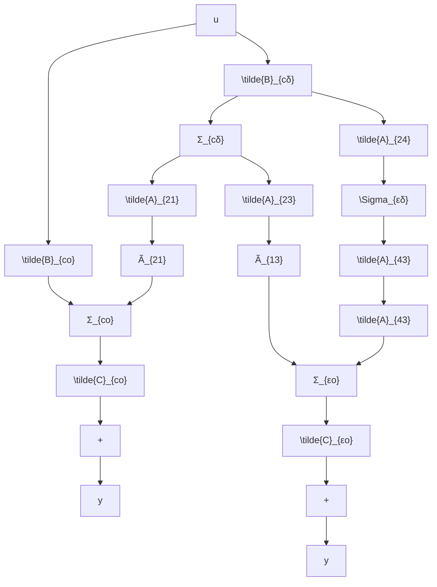

$$
\left[ \begin{array}{l} \dot {\tilde {x}} _ {e o} \\ \dot {\tilde {x}} _ {e \delta} \\ \dot {\tilde {x}} _ {z o} \\ \dot {\tilde {x}} _ {z \delta} \end{array} \right] = \left[ \begin{array}{c c c c} \widetilde {A} _ {e o} & 0 & \widetilde {A} _ {1 3} & 0 \\ \widetilde {A} _ {2 1} & \widetilde {A} _ {e \delta} & \widetilde {A} _ {2 3} & \widetilde {A} _ {2 4} \\ \hline 0 & 0 & \widetilde {A} _ {z o} & 0 \\ 0 & 0 & \widetilde {A} _ {4 3} & \widetilde {A} _ {z \delta} \end{array} \right] \left[ \begin{array}{l} \tilde {x} _ {e o} \\ \tilde {x} _ {e \delta} \\ \tilde {x} _ {z o} \\ \tilde {x} _ {z \delta} \end{array} \right] + \left[ \begin{array}{l} \widetilde {B} _ {e o} \\ \widetilde {B} _ {e \delta} \\ 0 \\ 0 \end{array} \right] u \tag {3.258}

\mathbf {y} = [ \widetilde {C} _ {c o} 0: \widetilde {C} _ {c o} 0 ] \left[ \begin{array}{l} \widetilde {x} _ {c o} \\ \widetilde {x} _ {c o} \\ \widetilde {x} _ {c o} \\ \widetilde {x} _ {c o} \end{array} \right]
$$

其中， $\tilde{x}_{c0}$ 为能控且能观测分状态， $\tilde{x}_{c5}$ 为能控但不能观测分状态， $\tilde{x}_{c6}$ 为不能控但能观测分状态， $\tilde{x}_{c8}$ 为不能控且不能观测分状态。

证 先将(3.257)按能控性分解化为(3.239)，再将所导出的能控部分(3.248)和不能控部分(3.249)按能观测性分解，则利用(3.254)的同时即可得到(3.258)。从而，证明完成。

由（3.258）所表示的规范分解表达式在形式上是唯一的。如果用 $\Sigma_{ij}(i = c, \bar{c}, j = o, \bar{o})$ 表示正向通道含积分器组而反馈通道中置环节 $A_{ij}$ 的基本反馈单元，则根据(3.258)可得到系统实现规范分解后的示意图如图3.8所示，图中用箭头表示各变量所能传递的方向。从图3.8可以很直观地看出： $\Sigma_{ij}$ 只有信号进入而无信号送出，故为能控但不能观测部分； $\Sigma_{jo}$ 只有信号送出而无信号进入，故为不能控但能观测部分； $\Sigma_{ij}$ 虽有信号进入和信号送出，但进入信号来自 $\Sigma_{jo}$ ，而送出信号只能到达 $\Sigma_{jo}$ ，所以为不能控且不能观测部分；只有 $\Sigma_{jo}$ ，能够实现信号由输入 $u$ 到输出 $y$ 间的传递，因此是能控和能观测的部分。

进一步，由系统结构的规范分解定理，还可导出如下的一个重要推论：

flowchart

图 3.8 系统结构规范分解的方块图

推论 对不完全能控和不完全能观测的线性定常系统(3.257)，其输入-输出描述即传递函数矩阵只能反映系统中能控且能观测的那一部分，即成立
