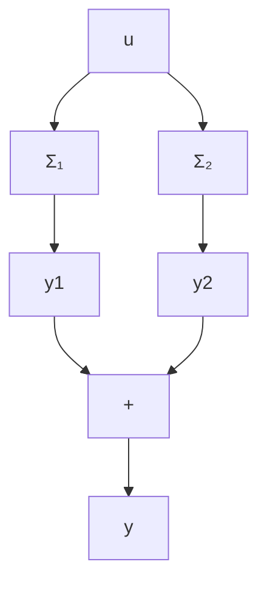

$$
\dot {\boldsymbol {x}} = \left[ \begin{array}{r r r} - 1 & 1 & a \\ 0 & - 2 & 1 \\ 0 & 0 & - 3 \end{array} \right] \boldsymbol {x} + \left[ \begin{array}{l} 0 \\ 0 \\ 1 \end{array} \right] \boldsymbol {u} \tag {i}
y = [ 0 \quad 0 \quad 1 ] x
\dot {\boldsymbol {x}} = \left[ \begin{array}{c c c} 0 & 0 & 1 \\ 0 & 1 & 0 \\ - 2 & - 3 & - 5 \end{array} \right] \boldsymbol {x} + \left[ \begin{array}{l} 0 \\ 1 \\ a \end{array} \right] \boldsymbol {u} \tag {ii}
y = [ 0 \quad 1 \quad b ] x
$$

3.6 计算下列系统的能控性指数和能观测性指数：

$$
\dot {\boldsymbol {x}} = \left[ \begin{array}{c c c} 0 & 1 & 0 \\ 0 & 0 & 1 \\ 0 & 3 & - 1 \end{array} \right] \boldsymbol {x} + \left[ \begin{array}{c c} 0 & 1 \\ 1 & 0 \\ 0 & 0 \end{array} \right] \boldsymbol {u}

\mathbf {y} = \left[ \begin{array}{c c c} 1 & 0 & 1 \\ 0 & 1 & 0 \end{array} \right] \mathbf {x}
$$

3.7 设时变系统 $\dot{\pmb{x}} = A(t)\pmb{x} + B(t)\pmb{u}$ 在 $t_{0}$ 时刻为完全能控，现知 $t_{1} > t_{0}$ 和 $t_{2} < t_{0}$ ，试论证此系统在 $t_{1}$ 和 $t_{2}$ 时刻是否也一定是完全能控的。

3.8 判断下列系统是否为完全能控:

(i) $\dot{x}=\begin{bmatrix}0&1\\ 0&t\end{bmatrix}x+\begin{bmatrix}0\\ 1\end{bmatrix}u,\quad t\geqslant0$

(ii) $\dot{x}=\begin{bmatrix}0&0\\ 0&1\end{bmatrix}x+\begin{bmatrix}1\\ e^{-2t}\end{bmatrix}u,\quad t\geqslant0$

(iii) $\dot{\pmb{x}} = \left[ \begin{array}{lll}t & 1 & 0\\ 0 & t & 0\\ 0 & 0 & t^2 \end{array} \right]\pmb {x} + \left[ \begin{array}{l}0\\ 1\\ 1 \end{array} \right]\pmb {u},\quad t\in [0,2]$

3.9 给定离散时间系统为:

$$
\left[ \begin{array}{l} x _ {1} (k + 1) \\ x _ {2} (k + 1) \end{array} \right] = \left[ \begin{array}{c c} 1 & 1 - e ^ {- T} \\ 0 & e ^ {- T} \end{array} \right] \left[ \begin{array}{l} x _ {1} (k) \\ x _ {2} (k) \end{array} \right] + \left[ \begin{array}{c} e ^ {- T} + T - 1 \\ 1 - e ^ {- T} \end{array} \right] u (k)
$$

其中 $T \neq 0$ ，试论证：此系统有无可能在不超过 $2T$ 的时间内使任意的一个非零初态转移到原点。

3.10 给定图 P3.1 所示的并联系统, 试证明: 并联系统 $\Sigma_{P}$ 为完全能控(完全能观测) 的必要条件是子系统 $\Sigma_{1}$ 和 $\Sigma_{2}$ 均为完全能控(完全能观测)。

flowchart

图 P 3.1

3.11 设有能控和能观测的线性定常单变量系统:

$$
\begin{array}{l} \dot {\boldsymbol {x}} = \left[ \begin{array}{c c c} - 1 & - 2 & - 2 \\ 0 & - 1 & 1 \\ 1 & 0 & 1 \end{array} \right] \boldsymbol {x} + \left[ \begin{array}{l} 2 \\ 0 \\ 1 \end{array} \right] u \\ y = [ 1 \quad 1 \quad 0 ] \boldsymbol {x} \end{array}
$$
