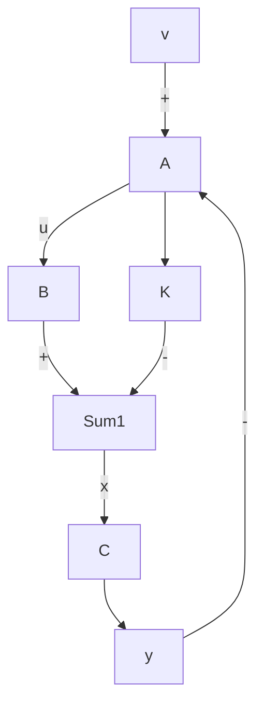
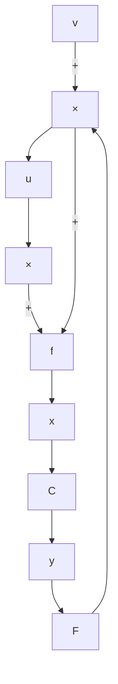

# 5.2 状态反馈和输出反馈

状态反馈和输出反馈的构成形式 考虑线性定常系统

$$\dot {x} = A x + B u \tag {5.5}\mathbf {y} = C \mathbf {x}$$

当将系统的控制 $\pmb{u}$ 取为状态 $\pmb{x}$ 的线性函数

$$\boldsymbol {u} = - K \boldsymbol {x} + \boldsymbol {v} \tag {5.6}$$

时，称其为线性的直接状态反馈，简称为状态反馈。而在把控制 $\pmb{u}$ 取为输出 $\pmb{y}$ 的线性函数

$$\boldsymbol {u} = - F \boldsymbol {y} + \boldsymbol {v} \tag {5.7}$$

时，相应地称为线性非动态输出反馈，简称为输出反馈。其中， $\pmb{v}$ 为参考输入，在调节问题中通常有 $\pmb{v} = 0$ ，而在跟踪问题中 $\pmb{v}$ 为非零的确定性向量函数。

状态反馈的构成形式如图 5.1 所示。状态反馈系统的状态空间描述，可由 (5.5) 和 (5.6) 容易导出，为：

$$
\begin{array}{l} \dot {\boldsymbol {x}} = (A - B K) \boldsymbol {x} + B \boldsymbol {v} \\ \boldsymbol {y} = C \boldsymbol {x} \end{array} \tag {5.8}
$$

而其传递函数矩阵则为

$$G _ {K} (s) = C (s I - A + B K) ^ {- 1} B \tag {5.9}$$

flowchart

图 5.1 状态反馈

flowchart

图 5.2 输出反馈

输出反馈的构成形式如图 5.2 所示。由 (5.5) 和 (5.7) 可以导出，输出反馈系统的状态空间描述为：

$$
\begin{array}{l} \dot {\boldsymbol {x}} = (A - B F C) \boldsymbol {x} + B \boldsymbol {v} \\ \boldsymbol {y} = C \boldsymbol {x} \end{array} \tag {5.10}
$$

输出反馈系统的传递函数矩阵则为:

$$G _ {F} (s) = C (s I - A + B F C) ^ {- 1} B \tag {5.11}$$

如果表受控系统的传递函数矩阵为:

$$G _ {\bullet} (s) = C (s I - A) ^ {- 1} B \tag {5.12}$$

则可把 $G_{F}(s)$ 进一步表为:

$$G _ {F} (s) = G _ {o} (s) \left[ I + F G _ {o} (s) \right] ^ {- 1} \tag {5.13}$$

或

$$G _ {F} (s) = [ I + G _ {o} (s) F ] ^ {- 1} G _ {o} (s) \tag {5.14}$$

不难看出,不管是状态反馈还是输出反馈,都可改变系统矩阵。但是,这并不是说,两者具有等同的改变系统结构属性和实现性能指标的功能。事实上,从后面各节的讨论中将可看到,在这方面状态反馈要远优越于输出反馈。而且,比较(5.8)和(5.10)还可看出,一个输出反馈系统可以达到的功能,必可找到相应的一个状态反馈系统来获得。但是,由于方程 FC = K 的解 F 通常不存在,所以相反的命题一般不成立。

状态反馈和输出反馈系统的能控性和能观测性 现来讨论，反馈的引入对作为系统基本结构特性的能控性和能观测性的影响。对此，有如下的两个结论。

结论 1 状态反馈的引入,不改变系统的能控性,但可能改变系统的能观测性。

证（i）首先来证明：状态反馈系统 $\Sigma_{K}$ 为能控的充分必要条件是受控系统 $\Sigma_{\bullet}$ 为能控。

表 $\Sigma_{0}$ 和 $\Sigma_{K}$ 的能控性判别阵分别为

$$Q _ {c} = [ B \mid A B \mid \dots \mid A ^ {* - 1} B ] \tag {5.15}$$

和

$$Q _ {c K} = [ B | (A - B K) B | \dots | (A - B K) ^ {n - 1} B ] \tag {5.16}$$
