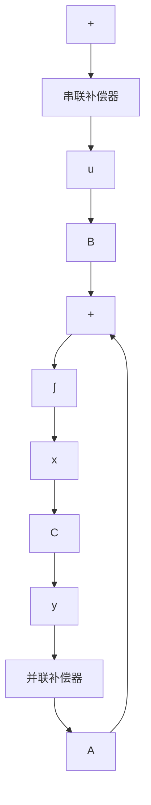

$$\operatorname{rank} Q _ {o} \leqslant \operatorname{rank} Q _ {o F} \tag {5.24}$$

从而，由（5.23）和（5.24）即得

$$\operatorname{rank} Q _ {\bullet} = \operatorname{rank} Q _ {o p} \tag {5.25}$$

表明输出反馈可保持能观测性。证明完成。

状态反馈和输出反馈的比较 从反馈信息的性质而言，由于状态 $x$ 可完全地表征系统结构的信息，因而状态反馈是一种完全的系统信息反馈。输出反馈则是系统结构信息的一种不完全反馈。一般地说，为使反馈系统获得良好的动态性能，必须采用完全信息反馈即状态反馈。欲使输出反馈也能达到满意的性能，需如图5.3所示那样，单独地或同时地引入串联补偿器和并联补偿器，而构成动态输出反馈系统。补偿器常为阶次较低的线性系统，它的引入提高了整个反馈系统的阶次。输出反馈和补偿器的综合问题，通常采用复频率域方法要更为直观和方便，有关综合原理和方法将在第11章中详细讨论。


<details>
<summary>flowchart</summary>


</details>

图 5.3 动态输出反馈


<details>
<summary>flowchart</summary>

```mermaid
graph TD
    v -->|+| A["×"]
    A --> u
    u --> B["×"]
    B --> f
    f --> x
    x --> C
    C --> y
    y --> K
    K --> x̂
    x --> A
    A -->|+| B
```
</details>

图 5.4 利用观测器来实现状态反馈

就反馈的工程构成而言,由于输出变量可直接量测,因此输出反馈显然要比状态反馈为优越。解决状态反馈的工程构成的一个现实的途径是如图5.4所示那样,引入附加的状态观测器,利用原系统的可量测变量y和u作为其输入以获得x的重构量 $\hat{x}$ ,并以此来实现状态反馈。通常,不可能做到使 $\hat{x}$ 和x为完全相等,但可做到使两者渐近相等即当 $t\to\infty$ 时 $\hat{x}(t)$ 和 $x(t)$ 相等。状态观测器也是一个线性系统,其维数为等于或小于被观测系统的维数。同样,状态观测器的引入也提高了反馈系统的阶次。有关状态观测器和带有状态观测器的状态反馈系统的分析和综合问题,将在本章的后几节中研究。
