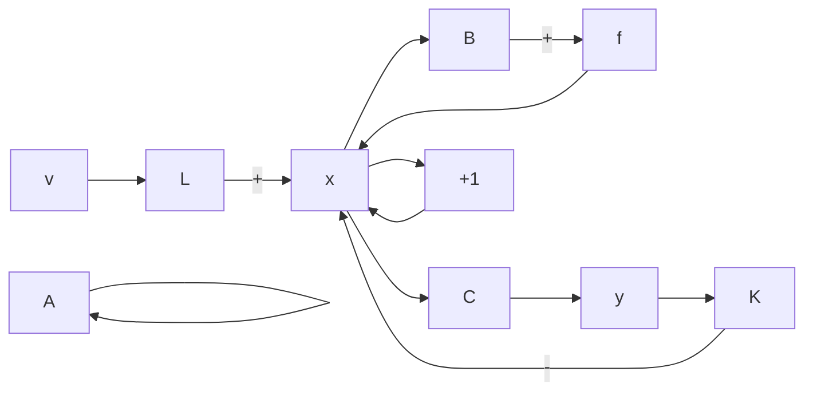

# 5.5 解耦控制问题: 可解耦条件和算法

问题的提法 考虑多输入-多输出的线性定常系统:

$$
\begin{array}{l} \dot {\boldsymbol {x}} = A \boldsymbol {x} + B \boldsymbol {u} \\ \boldsymbol {y} = C \boldsymbol {x} \end{array} \tag {5.72}
$$

其中，x 为 n 维状态向量，u 为 p 维控制向量，y 为 q 维输出向量。

同时，引入三个基本假定：(i) p = q，即输出和输入具有相同的变量个数。(ii) 控制律采用状态反馈结合输入变换，即取 $u = -Kx + Lv$ ，其中 K 为 $p \times n$ 反馈增益阵，L 为 $p \times p$ 输入变换阵，v 为参考输入。相应的反馈系统的结构图如图 5.5 所示。(iii) 输入变换阵 L 为非奇异，也即有 $\det L \neq 0$ 。

对于图 5.5 所示的包含输入变换的状态反馈系统, 可以定出其状态空间描述为:

$$
\begin{array}{l} \dot {\boldsymbol {x}} = (A - B K) \boldsymbol {x} + B L \boldsymbol {v} \\ \boldsymbol {y} = C \boldsymbol {x} \end{array} \tag {5.73}
$$

而其传递函数矩阵为：

$$G _ {K L} (s) = C (s I - A + B K) ^ {- 1} B L \tag {5.74}$$

并且，由于已假定 $p = q$ ，可知 $G_{KL}(s)$ 为 $p\times p$ 的有理分式矩阵。

flowchart

图 5.5 包含输入变换的状态反馈系统

于是，所谓解耦控制问题就是：对由（5.72）给出的多变量受控系统，寻找一个输入变换和状态反馈矩阵对 $\{L, K\}$ ，使得由（5.74）所定出的状态反馈系统的传递函数矩阵 $G_{KL}(s)$ 为非奇异对角线有理分式阵，即

$$
\begin{array}{l} G _ {K L} (s) = \operatorname{diag} \left(g _ {1 1} (s), g _ {2 2} (s), \dots , g _ {p p} (s)\right) \\ g _ {i i} (s) \neq 0, \quad i = 1, 2, \dots , p \end{array} \tag {5.75}
$$

容易看出,为了综合解耦控制问题,将面临两个有待研究的命题。一个是研究受控系统的可解耦性,即来建立使受控系统可通过状态反馈和输入变换而实现解耦所应遵循的条件。另一个是给出解耦控制问题的综合的算法,以便对于可解耦的系统,可确定出所要求的矩阵对 $\{L, K\}$ 。

考虑到关系式 $\hat{\mathcal{Y}}(s)=G_{KL}(s)\hat{\mathcal{V}}(s)$ ，可知当系统实现了解耦后，其输出变量和参考输入变量之间有如下的关系式：

$$\hat {y} _ {i} (s) = g _ {i i} (s) \hat {v} _ {i} (s), \quad i = 1, 2, \dots , p \tag {5.76}$$

这表明，尽管受控系统中包含着变量间的耦合，但通过外部的控制作用(状态反馈和输入变换)，可使一个 $p$ 维的多输入-多输出系统化成为 $p$ 个相互独立的单输入-单输出控制系统，而实现一个输出变量仅由一个输入变量所完全控制。

解耦控制大大简化了控制过程，使得对各个输出变量的控制均都可单独地进行。在许多工程问题中，特别是过程控制中，解耦控制有着重要的意义。

传递函数矩阵的两个特征量 我们首先要来引入并讨论传递函数矩阵的两个特征量,下面将可看到它们对研究系统的可解耦性有着重要的意义。

表 $G(s)$ 为 $\pmb{p} \times \pmb{p}$ 的传递函数矩阵， $\pmb{g}_i(s)$ 为它的第 $i$ 个行传递函数向量，并有

$$\boldsymbol {g} _ {i} (s) = \left[ g _ {i 1} (s), g _ {i 2} (s), \dots , g _ {i p} (s) \right] \tag {5.77}$$

再表

$\sigma_{ij} = g_{ij}(s)$ 的分母多项式的次数和 $g_{ij}(s)$ 的分子多项式的次数之差

则 $G(s)$ 的第一个特征量 $d_{i}$ 定义为：

$$d _ {i} = \min \left\{\sigma_ {i 1}, \sigma_ {i 2}, \dots , \sigma_ {i p} \right\} - 1, i = 1, 2, \dots , p \tag {5.78}$$
