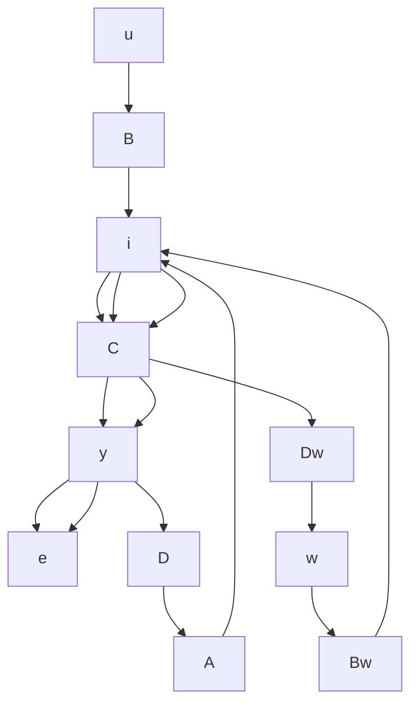

# 5.6 跟踪问题：无静差性和鲁棒控制

问题的提法 考虑同时作用有控制和扰动的线性定常受控系统

$$
\begin{array}{l} \dot {x} = A x + B u + B _ {w} w \\ \boldsymbol {y} = C \boldsymbol {x} + D \boldsymbol {u} + D _ {\omega} \boldsymbol {w} \tag {5.137} \\ \end{array}
$$

其中，x 为 n 维状态向量，u 为 p 维控制向量，y 为 q 维输出向量，w 为 q 维扰动向量。假

定 $\{A, B\}$ 为能控， $\{A, C\}$ 为能观测。此外，再令受控系统的输出 $y(t)$ 所要跟踪的参考信号为 $y_0(t)$ ，并表跟踪误差信号

$$\boldsymbol {e} (t) = \boldsymbol {y} _ {0} (t) - \boldsymbol {y} (t) \tag {5.138}$$

因此所谓跟踪问题,就是要讨论系统(5.137)在满足什么条件下可找到适当的控制规律u,来实现使 $y(t)$ 跟踪 $y_{0}(t)$ 的目标。相应于(5.137)和(5.138)的跟踪问题的系统结构框图如图5.6所示。

flowchart

图 5.6 跟踪问题的系统结构框图

由于物理可实现性的限制，要找到使对

于所有的 $t$ 均有 $\pmb {y}(t) = \pmb{y}_0(t)$ 的控制 $\pmb{\alpha}$ 是不可能的。通常，一般只可能做到使

$$\lim _ {t \rightarrow \infty} e (t) = \lim _ {t \rightarrow \infty} [ y _ {0} (t) - y (t) ] = 0 \tag {5.139}$$

这种情况称为无静差跟踪。考虑到系统为线性且同时作用有参考信号 $y_{0}(t)$ 和扰动 $w(t)$ ，因此式(5.139)意味着，对于 $w(t)=0$ 和任意的 $y_{0}(t)$ 有

$$\lim _ {t \rightarrow \infty} \mathbf {y} (t) = \lim _ {t \rightarrow \infty} \mathbf {y} _ {0} (t) \tag {5.140}$$

及对 $\pmb{y}_0(t) = 0$ 和任意的 $\pmb{w}(t)$ 相应的输出 $\pmb{y}_{\omega}(t)$ 满足关系式

$$\lim _ {t \rightarrow \infty} \mathbf {y} _ {w} (t) = \mathbf {0} \tag {5.141}$$

习惯上,称(5.140)的情况为渐近跟踪,而称(5.141)的情况为扰动抑制。因此,当系统实现无静差跟踪时,将可同时达到渐近跟踪和扰动抑制,也即同时对任意的 $y_{0}(t)$ 和任意的 $w(t)$ 使式(5.139)成立。

进一步, 如果参考信号 $y_{0}(t)$ 和扰动 $w(t)$ 两者当 $t \to \infty$ 时均趋于零, 那么只要寻找控制 u 使系统为渐近稳定, 式 (5.139) 就自动地成立, 也即无静差跟踪可自动地达到。显然, 这是一种比较直观的情况, 从而也就没有加以研究的必要。所以, 下面的讨论中我们总是假定

$$\lim _ {t \rightarrow \infty} y _ {0} (t) \neq 0 \tag {5.142}$$

和

$$\lim _ {t \rightarrow \infty} \boldsymbol {w} (t) \neq 0 \tag {5.143}$$

而且, 实际的工程问题中, 几乎绝大多数的参考信号和扰动都属于这种情况, 其例子如阶跃函数、斜坡函数、正弦余弦函数等。

参考信号和扰动的模型 设 $y_{0}(t)$ 和 $w(t)$ 当 $t \to \infty$ 时均不趋于零，并且对它们的属性没有任何了解，那么此时就无从讨论系统的渐近跟踪和扰动抑制问题。因此，为了研究跟踪问题，需要对 $y_{0}(t)$ 和 $w(t)$ 的某些结构性质有所了解，并据此建立起相应的信号模型。

对于标量的情况，设信号为未知幅值的阶跃函数，则其拉普拉斯变换就为 $\beta / s$ ；设信号为未知振幅和初始相位的正弦函数，那么它的拉普拉斯变换为 $(\beta_1 s + \beta_0) / (s^2 + \alpha^2)$ 。所以，一般地说，总可将标量的 $y_0(t)$ 和 $w(t)$ 的拉普拉斯变换 $\hat{y}_0(s)$ 和 $\hat{w}(s)$ 分别表示为

$$\hat {y} _ {0} (s) = n _ {y} (s) / d _ {y} (s) \tag {5.144}$$

和

$$\hat {w} (s) = n _ {w} (s) / d _ {w} (s) \tag {5.145}$$
