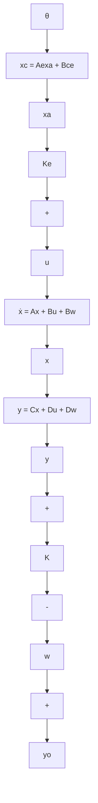

$$
\left[ \begin{array}{l} \dot {\boldsymbol {x}} \\ \dot {\boldsymbol {x}} _ {c} \end{array} \right] = \left[ \begin{array}{c c} A & 0 \\ - B _ {c} C & A _ {c} \end{array} \right] \left[ \begin{array}{l} \boldsymbol {x} \\ \boldsymbol {x} _ {c} \end{array} \right] + \left[ \begin{array}{c} B \\ - B _ {c} D \end{array} \right] \boldsymbol {u} + \left[ \begin{array}{c} B _ {w} \\ - B _ {c} D _ {w} \end{array} \right] \boldsymbol {w} + \left[ \begin{array}{l} 0 \\ B _ {e} \end{array} \right] y _ {0} \tag {5.155}
$$

再将 $\pmb{u}$ 取为状态反馈控制律：

$$
\boldsymbol {u} = \left[ - K, K _ {c} \right] \left[ \begin{array}{l} x \\ x _ {c} \end{array} \right] \tag {5.156}
$$

则可得到实现无静差跟踪的闭环控制系统。控制系统的结构图如图5.7所示。

下面,我们从图 5.7 的系统结构图出发,来给出受控系统可实现无静差跟踪所需满足的条件。

flowchart

图 5.7 无静差跟踪控制系统结构图

结论1 受控系统(5.137)可按图5.7所示的控制方式实现无静差跟踪的充分必要条件为：

(i) $\dim (\pmb {u})\geqslant \dim (\pmb {y})$   
(ii) 对 $\phi(s) = 0$ 的每一个根 $\lambda_{i}$ , 成立

$$
\operatorname{rank} \left[ \begin{array}{c c} \lambda_ {i} I - A & B \\ - C & D \end{array} \right] = n + q, \quad i = 1, 2, \dots , m \tag {5.157}
$$

证 分成两步来证明。

① 先证明：条件 (i) 和 (ii) 是串联系统 (5.155) 为能控的充分必要条件。

根据 PBH 秩判据, 当且仅当对每个 $s \in C$ 有

$$
\operatorname{rank} V (s) = \operatorname{rank} \left[ \begin{array}{c c c} s I - A & 0 \\ B _ {c} C & s I - A _ {c} \end{array} \right] = n + m q \tag {5.158}
$$

串联系统(5.155)为能控。按假定，已知 $\{A,B\}$ 为能控，故对每一个 $s\in C$ ，均有

$$\operatorname{rank} [ s I - A | B ] = n \tag {5.159}$$

此外，对不是 $A_{c}$ 的特征值即不是 $\phi (s)$ 的根的所有 $s$ ，显然有

$$\operatorname{rank} (s I - A _ {c}) = m q \tag {5.160}$$

这表明，由(5.159)和(5.160)以及 $V(s)$ 的结构可以断言，对不是 $\phi (s)$ 的根的所有 $s$ ，成立

$$\operatorname{rank} V (s) = n + m q \tag {5.161}$$

再来证明对 $\phi(s)$ 的所有根 $\operatorname{rank} V(s) = n + mq$ 也成立, 为此将 $V(s)$ 表为

$$
V (s) = \left[ \begin{array}{c c c} I _ {s} & \mathbf {0} & \mathbf {0} \\ \mathbf {0} & - B _ {c} & - (s I - A _ {c}) \end{array} \right] \left[ \begin{array}{c c c} s I - A & \mathbf {0} & B \\ - C & \mathbf {0} & D \\ \mathbf {0} & - I _ {\text {eq}} & \mathbf {0} \end{array} \right] \tag {5.162}
$$
