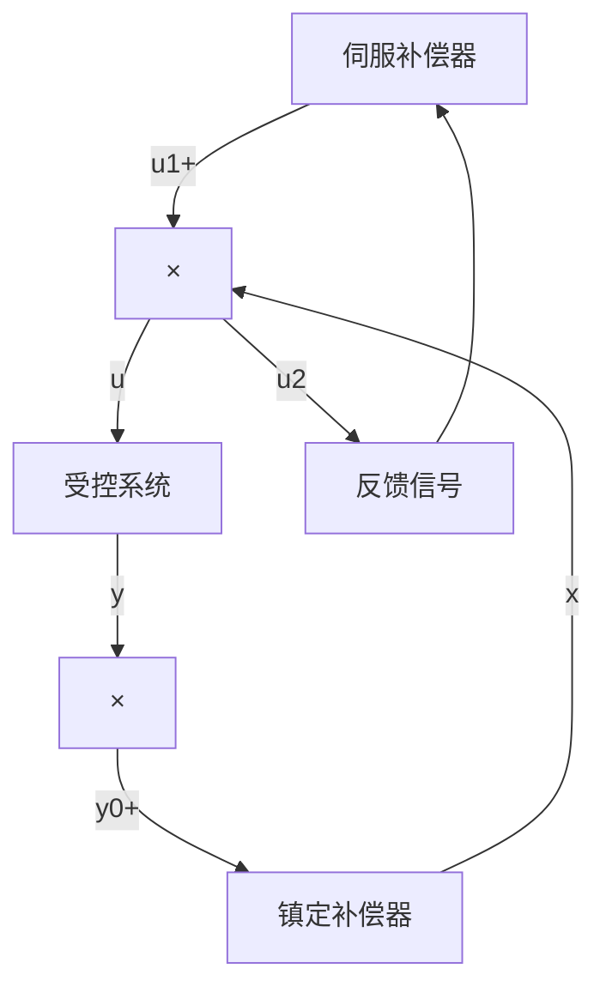

并且，由 $\{A_{c}, B_{c}\}$ 为能控规范形(见(5.151)—(5.154))可以导出，对任一 $s \in \mathcal{C}$ 成立

$$
\operatorname{rank} \left[ \begin{array}{c c c} I _ {n} & 0 & 0 \\ 0 & - B _ {c} & - (s I - A _ {c}) \end{array} \right] = n + m q \tag {5.163}
$$

而当且仅当（5.157）成立时，对 $\phi (s)$ 的所有根，可导出

$$
\operatorname{rank} \left[ \begin{array}{c c c} s I - A & 0 & B \\ - C & 0 & D \\ 0 & - I _ {m q} & 0 \end{array} \right] = n + q + m q, \quad \forall s = \lambda_ {i} \tag {5.164}
$$

于是，利用西尔维斯特（Sylvester）不等式：

$$\operatorname{rank} P + \operatorname{rank} Q - r \leqslant \operatorname{rank} P Q \leqslant \min \{\operatorname{rank} P, \operatorname{rank} Q \}$$

$P$ 为 $l \times r$ 阵, $Q$ 为 $r \times k$ 阵

可由(5.163)和(5.164)断言,对 $\phi(s)$ 的所有根,必成立

$$n + m q \leqslant \operatorname{rank} V (s) \leqslant n + m q, \quad \forall s = \lambda_ {i} \tag {5.165}$$

也即

$$\operatorname{rank} V (s) = n + m q \quad \forall s = \lambda_ {i} \tag {5.166}$$

将(5.161)和(5.166)加以联合,就证得

$$\operatorname{rank} V (s) = n + m q, \quad \forall s \in \mathcal {C} \tag {5.167}$$

再注意到，当且仅当条件(i)成立时才有可能使条件(ii)成立。所以，就证明了，条件(i)和(ii)是串联系统(5.155)为能控的充分必要条件。

② 再证明：条件 (i) 和 (ii) 是受控系统 (5.137) 可实现无静差跟踪的充分必要条件。

如上证得，当且仅当(i)和(ii)成立，串联系统(5.155)为能控。而这又等价于，存在状态反馈控制律(5.156)，使图5.7所示的反馈系统为渐近稳定。从而，当且仅当(i)

和（ii）成立时，可找到状态反馈增益阵 $\{K, K_{c}\}$ 使对任意 $y_{0}(t)$ 和 $w(t)$ 有

$$\lim _ {t \rightarrow \infty} e (t) = \lim _ {t \rightarrow \infty} [ y _ {0} (t) - y (t) ] = 0 \tag {5.168}$$

也即实现无静差跟踪。至此，就完成了整个证明。

进一步，我们可以把图5.7所示的无静差跟踪控制系统表示为更一般的形式，如图5.8所示。从图中可以看出，一个无

flowchart

图5.8 无静差跟踪系统结构的一般形式

静差跟踪控制系统，实质上是一个包含补偿器的输出反馈系统。其中，伺服补偿器的基本功能是使系统实现渐近跟踪和扰动抑制，它也是一个动态系统，其动态方程可表示为

$$\dot {x} _ {c} = A _ {c} x _ {c} + B _ {c} eu _ {1} = K _ {c} x _ {c} \tag {5.169}$$

而镇定补偿器的功能在于使整个反馈系统实现镇定，它是一个非动态的状态反馈，即

$$u _ {2} = K x \tag {5.170}$$

并且，利用这一事实，我们可直接导出如下的一个结论。

结论2 设受控系统（5.137）满足结论1中所给出的条件，则可使图5.8的控制系统实现无静差跟踪的充分必要条件，是引入系统的补偿器必须满足如下条件：

(i) 可对系统实现镇定。  
(ii) 伺服补偿器中必须包含 $y_0(t)$ 和 $w(t)$ 的不稳定信号模型。

通常，称这个引入系统的不稳定信号模型为内模。利用在系统内部复制一个 $y_{0}(t)$ 和 $w(t)$ 的不稳定信号模型，来达到完全的渐近跟踪和扰动抑制的原理，称之为内模原理。在旺纳姆（W. M. Wonham）的著作《线性多变量控制——一种几何方法》 $^{1)}$ 中，对内模原理采用几何方法作了系统和完整的讨论。
