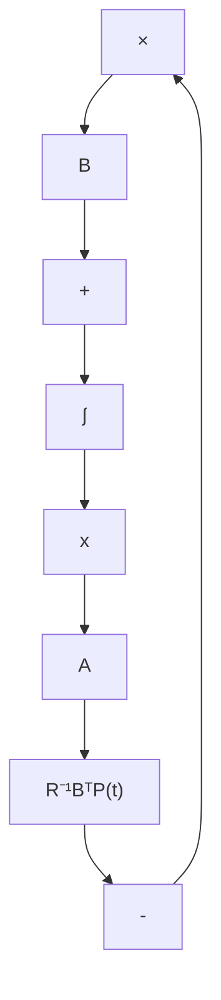

也即 $u^{*}(\cdot)$ 为最优控制。于是，充分性得证。至此，整个证明完成。

并且,从上述结论1出发,还可直接得到如下的有关有限时间LQ调节问题的另外一些重要的结论。

结论2 对于有限时间LQ调节问题(5.174)和(5.175)，其最优调节系统是一个状态反馈系统，并且反馈阵 $K^{*}(t) = R^{-1}B^{T}P(t)$ 是唯一的。最优调节系统的动态方程为：

$$\dot {\boldsymbol {x}} ^ {*} = [ A - B R ^ {- 1} B ^ {T} P (t) ] \boldsymbol {x} ^ {*}, \quad \boldsymbol {x} ^ {*} (0) = \boldsymbol {x} _ {0}, t \in [ 0, t _ {f} ] \tag {5.203}$$

flowchart

图 5.9 有限时间最优调节系统的结构图

其系统结构图如图 5.9 所示。

结论 3 对于有限时间 LQ 调节问题 (5.174) 和 (5.175)，尽管受控系统是定常的，但其最优调节系统却是时变的。

结论4 对于有限时间LQ调节问题(5.174)和(5.175)，其最优控制 $\pmb{u}^{*}(\cdot)$ 必是存在的，不依赖于系统 $\{A,B\}$ 是否为能控。

现在,推广来讨论时变的有限时间 LQ 调节问题:

$$\dot {\boldsymbol {x}} = A (t) \boldsymbol {x} + B (t) \boldsymbol {u}, \quad \boldsymbol {x} \left(t _ {0}\right) = \boldsymbol {x} _ {0}, t \in \left[ t _ {0}, t _ {f} \right] \tag {5.204}J (\boldsymbol {u} (\cdot)) = \frac {1}{2} \boldsymbol {x} ^ {T} \left(t _ {f}\right) S \boldsymbol {x} \left(t _ {f}\right) + \frac {1}{2} \int_ {t _ {0}} ^ {t _ {f}} \left[ \boldsymbol {x} ^ {T} Q (t) \boldsymbol {x} + \boldsymbol {u} ^ {T} R (t) \boldsymbol {u} \right] d t \tag {5.205}$$

其中， $A(t)$ 和 $B(t)$ 的元均为 t 的连续有界函数，S 为正半定对称常阵， $Q(t)$ 为连续、有界、正半定对称矩阵， $R(t)$ 为连续、有界、正定对称矩阵。并且，通过和结论 1 的类同的推证过程，即可得到此类调节问题的最优解的基本结论。

结论 5 对于时变的有限时间 LQ 调节问题 (5.204) 和 (5.205), $u^{*}(\cdot)$ 为其最优控制的充分必要条件是其具有形式:

$$\boldsymbol {u} ^ {*} (t) = - K ^ {*} (t) \boldsymbol {x} ^ {*} (t), \quad K ^ {*} (t) = R ^ {- 1} (t) B ^ {T} (t) P (t) \tag {5.206}$$

最优轨线 $x^{*}(t)$ 为下述状态方程的解：

$$\dot {x} ^ {*} (t) = A (t) x ^ {*} (t) + B (t) u ^ {*} (t), \quad x ^ {*} \left(t _ {0}\right) = x _ {0} \tag {5.207}$$

而最优性能值为

$$J ^ {*} = \frac {1}{2} x _ {0} ^ {T} P \left(t _ {0}\right) x _ {0}, \quad \forall x _ {0} \neq 0 \tag {5.208}$$

其中， $P(t)$ 为下述矩阵黎卡提微分方程的正半定对称解阵：

$$
\begin{array}{l} - \dot {P} (t) = P (t) A (t) + A ^ {T} (t) P (t) + Q (t) - P (t) B (t) R ^ {- 1} (t) B ^ {T} (t) P (t) \\ P \left(t _ {f}\right) = S, \quad t \in \left[ t _ {0}, t _ {f} \right] \tag {5.209} \\ \end{array}
$$
