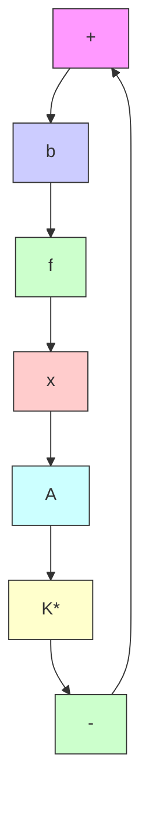

(a)

  
(b)   
图 5.10 单输入最优调节系统（a）及其等价闭环调节系统（b）

对于图 5.10(b) 所示的单输入-单输出反馈调节系统，如同在经典控制理论中所做的那样，系统的稳定性的裕度常采用增益裕度和相角裕度来表征。通常，增益裕度定义为增益 $\beta$ 的一个允许变化范围，当 $\beta$ 为处于这一范围内的任一值时闭环系统保持渐近稳定，反之则失去稳定。再如图 5.11 那样，分别作出开环频率响应 $g_{0}(j\omega)$ 当 $\omega=0\rightarrow\infty$ 时的曲线和圆心为原点半径为 1 的单位圆 $\Gamma_{0}$ ，可得两者的交点 e，则相角裕度定义为向量 oe 和负实轴的交角 $\theta$ ；当此交角 $\theta=0$ 时，也即 $g_{0}(j\omega)$ 曲线和单位圆 $\Gamma_{0}$ 交于负实轴上的 -1 点时，系统就达到临界不稳定。显然，系统参数的摄动将导致系统增益 $\beta$ 和相角 $\theta$ 的变化，而增益裕度和相角裕度愈大则允许的参数变化范围也将愈大。所以，可把增益裕度和相角裕度的大小采用来作为表征调节系统鲁棒性的一种量度，裕度愈大则鲁棒性愈好，反之亦然。

text_image

j
Γ₀
ω = ∞
-1 θ 0 1 +
e
g₀(jω)
ω = 0

图 5.11 相角裕度的定义的直观说明

text_image

Γ₁
-1
0
ω = ∞ +
g₀(jω)
ω = 0

图 5.12 单输入最优调节系统的频率条件的直观说明

对于单输入最优调节系统，由其频率条件（5.272）可导出，它必满足如下的关系式：

$$\left| 1 + g _ {0} (j \omega) \right| \geqslant 1 \tag {5.279}$$

从复数平面上看， $(1 + g_0(j\omega))$ 表示负实轴上的 $(-1, j_0)$ 点到 $g_0(j\omega)$ 曲线上各点的向量，而 $|1 + g_0(j\omega)|$ 表示向量的模即长度。因此，如图5.12所示那样，在复数平面上作出以 $(-1, j_0)$ 为圆心和以1为半径的圆 $\Gamma_1$ ，那么式（5.279）表明：单输入最优系统的开环频率响应

$$g _ {0} (j \omega) = k ^ {*} (j \omega I - A) ^ {- 1} b \tag {5.280}$$

当 $\omega$ 由 $0 \to \infty$ 时的曲线必定不会进入单位圆 $\Gamma_{1}$ 的内部。

于是，在上述讨论的基础上，就可给出单输入最优调节系统的鲁棒性的有关结论。

结论 2 对于无限时间的定常 LQ 调节问题, 单输入最优调节系统必具有

(i) 至少±60°的相角裕度；

(ii) 从 $1 / 2$ 到 $\infty$ 的增益裕度。
