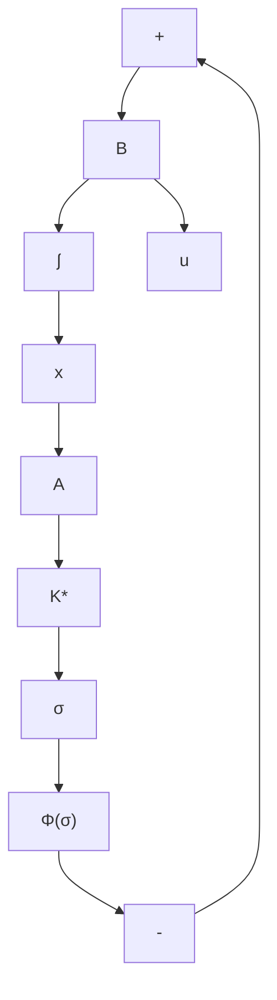

证 如图 5.13 所示，在复数平面上画出分别以原点和 $(-1, j0)$ 点为圆心的单位圆 $\Gamma_{0}$ 和 $\Gamma_{1}$ ; 由图可以看出，两个圆的交点与原点连线和负实轴的交角为 $\pm60^{\circ}$ , $\Gamma_{1}$ 与负实轴的左侧交点处坐标值为 -2。由此，并考虑到 $g_{0}(j\omega)$ 的曲线必位于圆 $\Gamma_{1}$ 外的事实，可知：在最坏情况下 $g_{0}(j\omega)$ 曲线和 $\Gamma_{1}$ 在交点 g 或 f 处相切，因此最优系统的相角裕度至少为 $\pm60^{\circ}$ ; $g_{0}(j\omega)$ 曲线与负实轴的最靠近 $(-1, j0)$ 点的非零交点在最坏情况下为 -2，也即 $|g_{0}(j\omega_{f})| = 2$ ，但在摄动下 $\beta g_{0}(j\omega)$ 通过 $(-1, j0)$ 点时系统进入临界不稳定（此时 $\beta = 1 / |g_{0}(j\omega_{f})| = 1/2$ ），表明当 $\beta$ 在 $\left(\frac{1}{2}, \infty\right)$ 范围内变化时 $\beta g_{0}(j\omega)$ 曲线必不会通过点 $(-1, j0)$ 也即系统保持渐近稳定，从而最优系统的增益裕度为 $\left(\frac{1}{2}, \infty\right)$ 。于是，证明完成。

text_image

Γ₁
f
-2
-1
-60°
+60°
0
Γ₆
+
g₀(jω)

图 5.13 对最优系统的鲁棒性的证明

上述相对于单输入最优调节系统的鲁棒性的结论可推广于多输入情况时的无限时间定常LQ问题，其相应的论断由下述结论给出。

结论3 对于无限时间的定常LQ调节问题的多输入最优调节系统，取加权阵 $R = \operatorname{diag}\{\rho_1, \dots, \rho_p\}$ ， $\rho_i > 0$ ，则系统的每一个反馈控制回路均必具有：

(i) 至少 $\pm60^{\circ}$ 的相角裕度；  
(ii) 从 $1 / 2$ 到 $\infty$ 的增益裕度。

进一步,我们讨论对反馈通道中的非线性摄动的鲁棒性问题。这一问题可等价为在理想的最优调节系统的反馈通道中引入附加的非线性环节 $\Phi(\sigma)$ , $\sigma = K^{*}x$ , 如图 5.14 所示。因此, 在反馈通道中包含非线性摄动时, 最优调节系统的状态方程就化成为:

$$\dot {\boldsymbol {x}} = A \boldsymbol {x} - B \Phi (\sigma)\sigma = K ^ {*} x, \quad K ^ {*} = R ^ {- 1} B ^ {T} P \tag {5.281}$$

于是，问题是要找出非线性 $\Phi(\sigma)$ 应满足的条件，使得对满足条件的非线性摄动 $\Phi(\sigma)$ 闭环系统 (5.281) 保持渐近稳定。

flowchart

图 5.14 包含非线性摄动的最优调节系统

line

| σ | φ(σ) |
| --- | --- |
| -3 | 0 |
| -2 | 1 |
| -1 | 2 |
| 0 | 0 |
| 1 | 1 |
| 2 | 2 |
| 3 | 0 |

图 5.15 非线性摄动 $\phi(\sigma)$ 的扇形容许区域

结论4 对于无限时间定常LQ调节问题，设最优调节系统的反馈通道内包含非线性摄动 $\Phi (\sigma)$ ，则当 $\Phi (\sigma)$ 满足如下的扇形条件时：

$$k _ {1} \sigma^ {T} R \sigma \leqslant \sigma^ {T} R \Phi (\sigma) \leqslant k _ {2} \sigma^ {T} \sigma , \quad \forall \sigma \neq 0 \tag {5.282}$$

其中 $k_{1} > 1 / 2$ 和 $k_{2} < \infty$ ，闭环系统保持为大范围渐近稳定。
