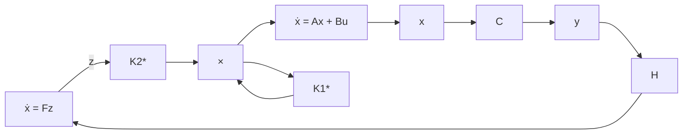

$$P A + A ^ {T} P + C ^ {T} Q C - P B R ^ {- 1} B ^ {T} P = 0 \tag {5.296}P _ {1 2} F + A ^ {T} P _ {1 2} - C ^ {T} Q H - P B R ^ {- 1} B ^ {T} P _ {1 2} = 0 \tag {5.297}P _ {2 2} F + F ^ {T} P _ {2 2} + H ^ {T} Q H - P _ {1 2} ^ {T} B R ^ {- 1} B ^ {T} P _ {1 2} = 0 \tag {5.298}$$

于是，就可定出跟踪问题(5.285)—(5.287)的最优控制 $u^{*}(\cdot)$ 为：

$$
\begin{array}{l} \boldsymbol {u} ^ {*} (t) = - R ^ {- 1} \left[ B ^ {T} \quad 0 \right] \left[ \begin{array}{l l} P & P _ {1 2} \\ P _ {1 2} ^ {T} & P _ {2 2} \end{array} \right] \left[ \begin{array}{l} x \\ z \end{array} \right] \\ = - R ^ {- 1} B ^ {T} P x - R ^ {- 1} B ^ {T} P _ {1 2} z \\ = - K _ {1} ^ {*} x - K _ {2} ^ {*} z \tag {5.299} \\ \end{array}
$$

其中 $K_{1}^{*} = R^{-1}B^{T}P$ 和 $K_{2}^{*} = R^{-1}B^{T}P_{12}$ ；而最优性能值则为：

$$
\begin{array}{l} J ^ {*} = \left[ \boldsymbol {x} _ {0} ^ {T} \cdot \boldsymbol {z} _ {0} ^ {T} \right] \left[ \begin{array}{l l} P & P _ {1 2} \\ P _ {1 2} ^ {T} & P _ {2 2} \end{array} \right] \left[ \begin{array}{l} \boldsymbol {x} _ {0} \\ \boldsymbol {z} _ {0} \end{array} \right] \\ = x _ {0} ^ {T} P x _ {0} + z _ {0} ^ {T} P _ {2 2} z _ {0} + 2 x _ {0} ^ {T} P _ {1 2} z _ {0} \tag {5.300} \\ \end{array}
$$

进一步,综合上面的讨论结果,可给出关于最优跟踪问题的基本结论为:

flowchart

图5.16 最优跟踪系统的结构图

结论 受控系统(5.285)跟踪信号系统(5.286)的相对于二次型性能指标(5.287)的最优控制律 $u^{*}(\cdot)$ 如(5.299)所示，相应的最优性能值 $J^{*}$ 如(5.300)所示，最优跟踪系统的结构如图5.16所示。

矩阵黎卡提方程的求解问题 如前面讨论中所显示的那样，从计算的

角度而言，LQ最优控制问题综合中的关键步骤归结为求解矩阵黎卡提代数方程或微分方程。业已断言，对于一般的情况，不可能找到由系数矩阵和加权矩阵直接表示的解阵的解析表达式；通常多采用数值方法，利用计算机来求解黎卡提矩阵方程。近二十年来，求解黎卡提矩阵方程的算法受到广泛的研究，提出了十几种不同的算法，如直接数值解法、增量迭代法、舒尔（Schur）向量法、特征向量法、符号函数法等。各种算法常各有其局限性，只能适用于一类黎卡提方程的求解问题。相应的计算机软件也已可以利用。限于本书的范围，这里将不对矩阵黎卡提方程的求解算法和计算机程序进行详细的讨论，有兴趣的读者可参阅有关的教科书、专著和文献。
