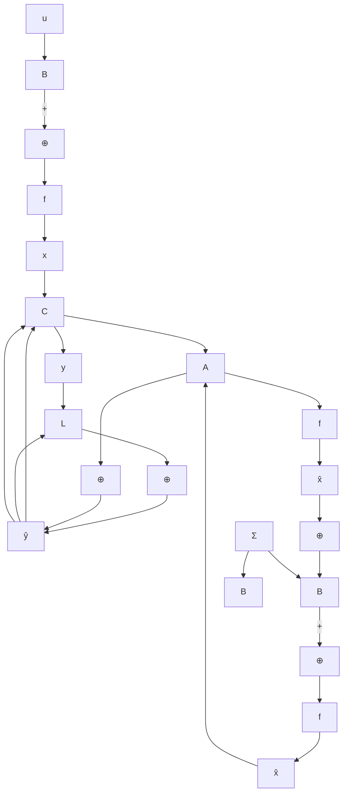
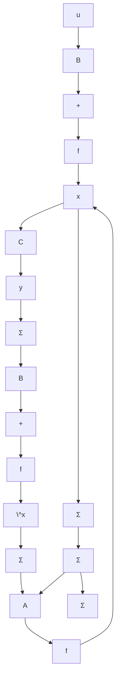

flowchart

图 5.18 全维状态观测器

flowchart

图 5.19 全维状态观测器

从图 5.18 可以导出, 按上述方式所构成的全维状态观测器的动态方程为:

$$\dot {\hat {x}} = A \hat {x} + B u + L (y - C \hat {x}), \quad \hat {x} (0) = \hat {x} _ {0} \tag {5.305}$$

其中修正项 $L(\pmb{y} - C\hat{\pmb{x}})$ 起到了反馈的作用。而且，由比较(5.303)和(5.305)还可看出，此状态观测器在维数上显然等同于被估计系统，两者的唯一差别仅在于式(5.305)中引入了修正项 $L(\pmb{y} - C\hat{\pmb{x}})$ 。为了说明引入此修正项的作用，不妨来讨论当(5.305)中去掉此修正项后会可能产生的问题。可看出，如此得到的观测器就是对被估计系统的直接复制，即为

$$\dot {\hat {x}} = A \hat {x} + B u, \quad \hat {x} (0) = \hat {x} _ {0} \tag {5.306}$$

因此一般地说同样可达到重构状态的目的。并且，如果进而能做到使初态 $\hat{x}_0 = x_0$ ，则理论上可实现对所有 $t \geqslant 0$ 均成立 $\hat{x}(t) = x(t)$ ，即实现完全的状态重构。但是，这种开环型的观测器实际上是难于应用的，它的两个主要的缺点是：第一，每次用这种观测器前都必须设置初始状态 $\hat{x}_0$ 使等同于 $x_0$ ，这显然是不方便的；第二，更为严重的是，如果系数矩阵 $A$ 包含不稳定的特征值，那么即使 $\hat{x}_0$ 和 $x_0$ 间的很小偏差，也会导致随着 $t$ 的增加而使 $\hat{x}(t)$ 和 $x(t)$ 间偏差愈来愈大。修正项 $L(y - C\hat{x})$ 就是为了克服这些问题而引入的。

进一步，考虑到 y = Cx，并将其代入 (5.305)，则此种全维状态观测器的动态方程可表为

$$\dot {\hat {x}} = (A - L C) \hat {x} + L C x + B u, \hat {x} (0) = \hat {x} _ {0} \tag {5.307}$$

相应地观测器的结构图可表为图5.19所示的形式。再表 $\tilde{x} = x - \tilde{x}$ 为真实状态和估计状态间的误差，那么利用(5.303)和(5.307)就可导出 $\tilde{x}$ 所应满足的动态方程为：
