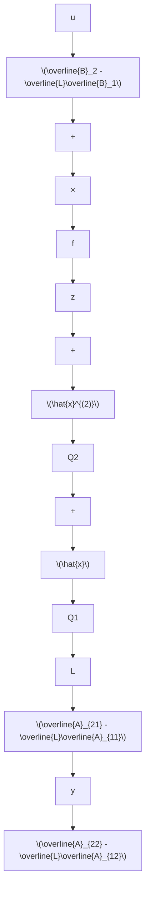

$$
\hat {x} = \left[ Q _ {1} - Q _ {2} \right] \left[ \begin{array}{c} y \\ z + \bar {L} y \end{array} \right] = Q _ {1} y + Q _ {2} (z + \bar {L} y) \tag {5.337}
$$

(6) 根据上述分析结果, 即可作出给定系统 (5.322) 的 $(n - q)$ 维降维状态观测器的结构图, 如图 5.20 所示。

方法 II: 考虑 $n$ 维线性定常系统 $\{A, B, C\}$ , 已知 $\{A, C\}$ 为能观测, $\operatorname{rank} C = q$ 。

flowchart

图 5.20 降维状态观测器

现取 $(n-q)$ 维线性定常系统:

$$\dot {\boldsymbol {z}} = F \boldsymbol {z} + G \boldsymbol {y} + H \boldsymbol {u} \tag {5.338}$$

其中，待定系数矩阵 $F, G$ 和 $H$ 分别为 $(n - q) \times (n - q), (n - q) \times q$ 和 $(n - q) \times p$ 实常阵。

和全维状态观测器中所作的分析相类同，我们首先来指出（5.338）所示的系统可作为被估计系统 $\{A, B, C\}$ 的降维状态观测器所应满足的条件。

结论1 系统（5.338）可作为给定系统 $\{A, B, C\}$ 的 $(n - q)$ 维降维观测器的充分必要条件，是存在一个使

$$
P = \left[ \begin{array}{l} C \\ T \end{array} \right] \tag {5.339}
$$

为非奇异的 $(n - q) \times n$ 满秩阵 $T$ , 使成立

(1) $TA - FT = GC$   
(2) $H = TB$   
(3) F 的全部特征值 $\lambda_{i}(F), i = 1, 2, \cdots, (n - q)$ ，均具有负实部。

并且，估计状态 $\hat{x}$ 即为：

$$
\hat {x} = \left[ \begin{array}{l} C \\ T \end{array} \right] ^ {- 1} \left[ \begin{array}{l} y \\ z \end{array} \right] = \left[ Q _ {1}, Q _ {2} \right] \left[ \begin{array}{l} y \\ z \end{array} \right] = Q _ {1} y + Q _ {2} z \tag {5.340}
$$

其中， $Q \triangleq \begin{bmatrix} C \\ T \end{bmatrix}^{-1} = [Q_1, Q_2]$ ，而 $Q_{1}$ 和 $Q_{2}$ 分别为 $n \times q$ 和 $n \times (n - q)$ 矩阵。

证 利用全维观测器中方法 II 的结论 1 的类似推证过程，可证得 z 是 Tx 的一个渐近估计，从而有 $z = T \hat{x}$ 。另一方面，易知

$$\lim _ {t \rightarrow \infty} \mathbf {y} (t) = \lim _ {t \rightarrow \infty} C \mathbf {x} (t) = \lim _ {t \rightarrow \infty} C \hat {\mathbf {x}} (t) \tag {5.341}$$

又可导出 $y = C\hat{x}$ 。于是，将两者结合，可得

$$
\left[ \begin{array}{l} C \\ T \end{array} \right] \hat {x} = \left[ \begin{array}{l} y \\ z \end{array} \right] \tag {5.342}
$$

而由此可立即导出(5.340)。证明完成。

进一步,再来指出使(5.339)的矩阵为非奇异的满秩阵T存在所应遵循的条件。

结论2 设 $A$ 和 $F$ 不具有公共的特征值，则方程 $TA - FT = GC$ 存在满秩解阵 $\pmb{T}$ 使

$$
P = \left[ \begin{array}{l} C \\ T \end{array} \right] \tag {5.343}
$$
