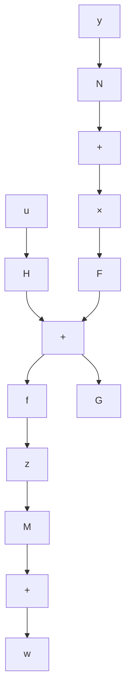

第6步：求解方程

$$\tilde {K} = - \left[ t _ {1, p - 1}, t _ {1, p - 2}, \dots , t _ {1 1} \right] L V$$

定出 $t_{1,v-1}, t_{1,v-2}, \cdots, t_{12}, t_{11}$ ，且组成

$$
T _ {i} \triangleq \left[ \begin{array}{c} {\pmb {t} _ {1 1}} \\ {\pmb {t} _ {1 2}} \\ {\vdots} \\ {\pmb {t} _ {i, \nu - 1}} \end{array} \right] - (\nu - 1) \times q \text {阵}
$$

第7步：计算

$$
\begin{array}{l} \boldsymbol {t} _ {2 1} = \overline {{K}} _ {2} \\ \boldsymbol {t} _ {2 2} = \overline {{K}} _ {2} \overline {{A}} _ {2 2} + \boldsymbol {t} _ {1 1} \overline {{A}} _ {1 2} \\ \boldsymbol {t} _ {2 3} = \bar {\boldsymbol {K}} _ {2} \bar {\boldsymbol {A}} _ {2 2} ^ {2} + \boldsymbol {t} _ {1 1} \bar {\boldsymbol {A}} _ {1 2} \bar {\boldsymbol {A}} _ {2 2} + \boldsymbol {t} _ {1 2} \bar {\boldsymbol {A}} _ {1 2} \\ \bullet \quad \bullet \quad \bullet \quad \bullet \quad \bullet \\ \boldsymbol {t} _ {2, v - 1} = \bar {K} _ {2} \bar {A} _ {2 2} ^ {v - 2} + \boldsymbol {t} _ {1 1} \bar {A} _ {1 2} \bar {A} _ {2 2} ^ {v - 3} + \dots + \boldsymbol {t} _ {1, v - 1} \bar {A} _ {1 2} \bar {A} _ {2 2} + \boldsymbol {t} _ {1, v - 2} \bar {A} _ {1 2} \\ \end{array}
$$

并组成

$$
T _ {2} \triangleq \left[ \begin{array}{c} {\pmb {t} _ {2 1}} \\ {\pmb {t} _ {2 2}} \\ {\vdots} \\ {\pmb {t} _ {2, \nu - 1}} \end{array} \right] - (\nu - 1) \times (n - q) \text {阵}
$$

第8步：组成

$$T \triangleq [ T _ {1}: T _ {2} ] - (\nu - 1) \times n \text { 阵 }$$

并计算

$$
\begin{array}{l} G = T _ {1} \overline {{{A}}} _ {1 1} + T _ {2} \overline {{{A}}} _ {2 1} - F T _ {1} \\ H = T \bar {B} \\ N = \bar {K} _ {1} - M T _ {1} = \bar {K} _ {1} - t _ {u} \\ \end{array}
$$

第9步：所要设计的 $(\nu - 1)$ 维函数观测器为：

$$
\begin{array}{l} \dot {z} = F z + G y + H u \\ w = M z + N y \tag {5.366} \\ \end{array}
$$

且成立

$$\lim _ {t \rightarrow \infty} w (t) = \lim _ {t \rightarrow \infty} K x (t)$$

而函数观测器的组成结构图如图 5.21 所示。

flowchart

图 5.21 Kx 的函数观测器

(3) 对于函数 $Kx$ , 其中 $K$ 为 $p \times n$ 常阵, 其函数观测器的最小维数常因具体问题的不同而不同, 情况比较复杂。但是, 若 $p \times n$ 阵 $K$ 是秩 1 的, 即 $\operatorname{rank} K = 1$ , 则通过表

$K = \rho K$ ，其中 $\pmb{\rho}$ 和 $K$ 分别为 $p \times 1$ 和 $1 \times n$ 常向量，同样可采用一个 $\nu - 1$ 维函数观测器来重构 $Kx$ 。此时，函数观测器如(5.366)所示，且 $\rho w(t)$ 即为 $Kx(t)$ 的渐近重构函数。
