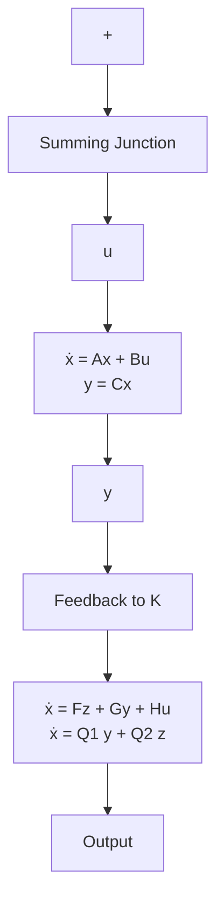

# 5.9 引入观测器的状态反馈控制系统的特性

观测器的建立解决了受控系统的不能量测的状态的重构问题，使得状态反馈的工程实现成为可能。但是，状态反馈是相对于受控系统的真实状态进行综合的，因此采用重构状态代替真实状态来实现状态反馈将会产生那些影响和问题，这自然是系统设计者和分析者所关心的课题。本节中，我们将就这一课题进行系统的讨论，来阐明包含观测器的状态反馈控制系统的基本特性。

包含观测器的状态反馈系统的组成 考虑 n 维的线性定常受控系统:

$$
\begin{array}{l} \Sigma_ {0}: \dot {\boldsymbol {x}} = A \boldsymbol {x} + B \boldsymbol {u} \\ \mathbf {y} = C \mathbf {x} \tag {5.367} \\ \end{array}
$$

其中，A, B 和 C 分别为 $n \times n, n \times p$ 和 $q \times n$ 实常阵，且假定 $\{A, B\}$ 为能控和 $\{A, C\}$ 为能观测。并且，按照性能指标（如极点配置、镇定、解耦和二次型最优等）的要求，可定出状态反馈控制：

$$\boldsymbol {u} = - K \boldsymbol {x} + \boldsymbol {v} \tag {5.368}$$

其中，K 为 $p \times n$ 常阵，v 为 p 维参考输入。而为了实现状态反馈，还需要引入观测器（全维状态观测器、降维状态观测器、函数观测器等）以重构系统的状态或反馈函数。不失一般性，令所引入的为 $(n - q)$ 维降维状态观测器：

$$
\Sigma_ {0 b}: \dot {\boldsymbol {z}} = F \boldsymbol {z} + G \boldsymbol {y} + H \boldsymbol {u}
\hat {\boldsymbol {x}} = \left[ \begin{array}{l} C \\ T \end{array} \right] ^ {- 1} \left[ \begin{array}{l} \boldsymbol {y} \\ \boldsymbol {z} \end{array} \right] = \left[ \begin{array}{l l} Q _ {1} & Q _ {2} \end{array} \right] \left[ \begin{array}{l} \boldsymbol {y} \\ \boldsymbol {z} \end{array} \right] \tag {5.369}
$$

其中， $F$ 的特征值可按要求任意配置，并有关系式：

$$
T A - F T = G C, \quad H = T B \tag {5.370}
\left[ \begin{array}{l l} Q _ {1} & Q _ {2} \end{array} \right] \left[ \begin{array}{l} C \\ T \end{array} \right] = Q _ {1} C + Q _ {2} T = I \tag {5.371}
$$

而 $F, G$ 和 $H$ 分别为 $(n - q) \times (n - q)$ , $(n - q) \times q$ 和 $(n - q) \times p$ 常阵, $T$ 为 $(n - q) \times n$ 常阵, $Q_{1}$ 和 $Q_{2}$ 分别为 $n \times q$ 和 $n \times (n - q)$ 常阵。这样, 利用 (5.367)—(5.369), 就可组成包含观测器的状态反馈系统, 如图 5.22 所示。其中, 状态反馈控制律中的状态 $x$ 由其重构值 $\hat{x}$ 所代替。

flowchart

图 5.22 包含观测器的状态反馈系统

进一步，由上述关系式，不难导出：

$$
\begin{array}{l} \dot {x} = A x + B v - B K \hat {x} = A x + B v - B K Q _ {1} C x - B K Q _ {2} z \\ = (A - B K Q _ {1} C) x - B K Q _ {2} z + B v \tag {5.372} \\ \end{array}
$$

和

$$
\begin{array}{l} \dot {z} = F z + G C x + H v - H K \hat {x} \\ = (G C - H K Q _ {1} C) \boldsymbol {x} + (F - H K Q _ {2}) \boldsymbol {z} + H \boldsymbol {v} \tag {5.373} \\ \end{array}
$$

从而，由（5.372）和（5.373）联合并表为增广方程的形式，就可得到图5.22的包含观测器的状态反馈系统的动态方程为：
