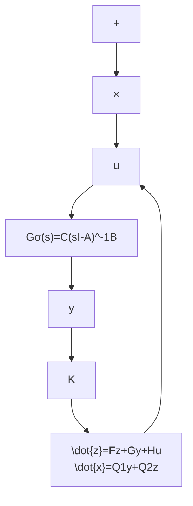
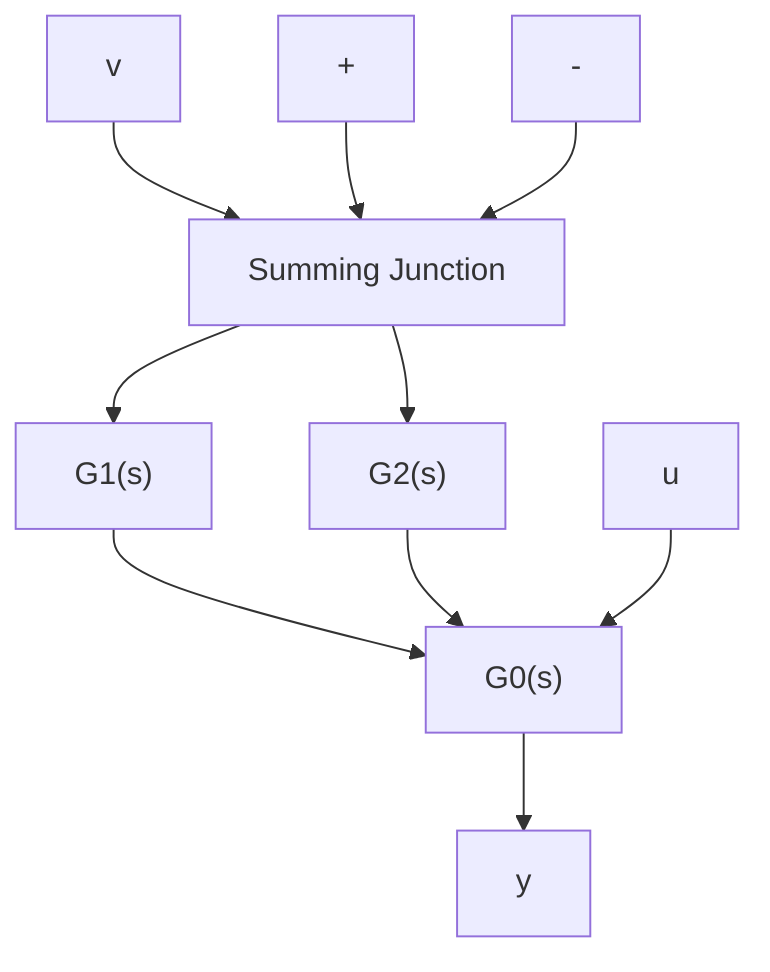
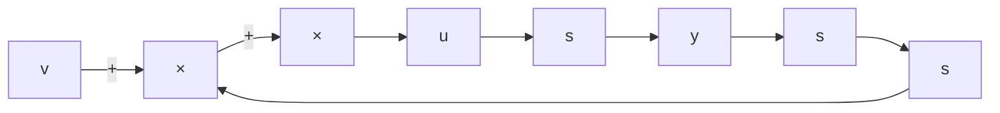
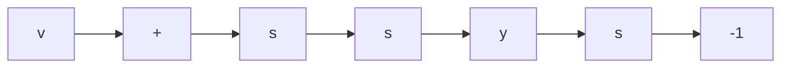

$$u = v + [ 2 \quad 5 \quad 1 6 \quad 1 0 ] \hat {x}$$

这里 $\nu$ 为标量参考输入。

包含观测器的状态反馈系统与包含补偿器的输出反馈系统的等价性 实际上，一个引入观测器的状态反馈系统，就输出一输入关系的角度而言，将可等价地化成为一个同时引入串联补偿器和并联补偿器的输出反馈系统。为了说明这一点，考察图5.23所示的带有观测器的状态反馈系统，其中 $G_{0}(s)=C(sI-A)^{-1}B$ 为受控系统的传递函数矩阵，而观测器不妨取为降维状态观测器

$$\dot {z} = F z + G y + H u \tag {5.384}\hat {x} = Q _ {1} y + Q _ {2} z$$

K 则为状态反馈增益矩阵。

把状态反馈一观测器看成为是一个以 y 和 $\alpha$ 为输入而以 $\tilde{\sigma}$ 为输出的线性定常系统，且表 $G_{1}(s)$ 和 $G_{2}(s)$ 分别为由 $\pmb{u}$ 到 $\bar{\pmb{v}}$ 和由 $\pmb{y}$ 到 $\bar{\pmb{v}}$ 的传递函数矩阵，则由 $\bar{\pmb{v}} = K\hat{\pmb{x}}$ 和(5.384)即可导出：

flowchart

图 5.23 带有观测器的状态反馈系统

flowchart

图 5.24 等价于图 5.23 的输出反馈系统

$$G _ {1} (s) = K Q _ {2} (s I - F) ^ {- 1} H \tag {5.385}$$

和

$$G _ {2} (s) = K Q _ {2} (s I - F) ^ {- 1} G + K Q _ {1} \tag {5.386}$$

这样,就可把图 5.23 所示的状态反馈系统等价地表为图 5.24 所示的输出反馈系统。

进一步，利用结构图的化简，还可等价地把图5.24所示的输出反馈系统化成为图5.25所示的形式。然后，再对图5.25系统中的小闭环部分加以化简，那么就导出了等价于带观测器的状态反馈系统（图5.23）的一个同时带有串联补偿器和并联补偿器的输出反馈系统，如图5.26所示。其中，并联补偿器的传递函数矩阵为：

$$G _ {p} (s) = G _ {2} (s) \tag {5.387}$$

而串联补偿器的传递函数矩阵为:

$$G _ {T} (s) = [ I + G _ {1} (s) ] ^ {- 1} \tag {5.388}$$

flowchart

图 5.25 等价于图 5.24 的输出反馈系统

flowchart

图 5.26 带有串联补偿器和并联补偿器的输出反馈系统

但是,应当指出,如果我们直接在复频率域内来综合带补偿器的输出反馈系统,那么常常只需引入串联补偿器就可使输出反馈系统达到所要求的性能指标。对这方面的系统的和详细的讨论,将在第11章中给出。
