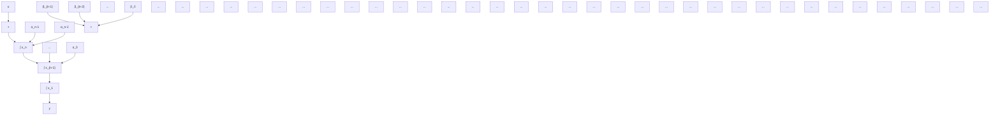

</details>

图 9.1 传递函数 $g(t)$ 的能控规范形实现


<details>
<summary>flowchart</summary>

```mermaid
graph TD
    y --> x_n["x_n"]
    x_n --> f1["f"]
    f1 --> add1["+"]
    add1 --> x_{n-1}[x_{n-1}]
    x_{n-1} --> f2["f"]
    f2 --> add2["+"]
    add2 --> x_1["x_1"]
    x_1 --> f3["f"]
    f3 --> add3["+"]
    add3 --> x_n_minus_2["-a_{n-2}"]
    x_n_minus_2 --> add1
    x_n_minus_2 --> add2
    x_n_minus_2 --> add3
    add1 --> β_n_minus_1["β_{n-1}"]
    add2 --> β_n_minus_2["β_{n-2}"]
    add2 --> ...[...]
    add3 --> β0["β_0"]
    β_n_minus_1 --> u["u"]
    β_n_minus_2 --> u
    β0 --> x_1
    x_1 --> f4["f"]
    f4 --> add3
    x_n_minus_2 -.-> add2
    add2 -.-> x_n_minus_2
    x_n_minus_2 -.-> add3
    add3 -.-> x_n
```
</details>

图 9.2 传递函数 $g(s)$ 的能观测规范形实现

下面给出的几点讨论,也是和能控规范形实现的有关结论相类同的,因此相应的证明过程一并略去。

① 不管给定的 $g(s)$ 中分母多项式 $d(s)$ 和分子多项式 $n(s)$ 是否为互质，实现 $(\overline{A}, \overline{b}, \overline{c})$ 总是能观测的且具有能观测规范形，因此称其为能观测规范形实现。  
② 如果 $g(s)$ 中 $d(s)$ 和 $n(s)$ 为互质, 则(9.61)的能观测规范形实现 $(\overline{A}, \overline{b}, \overline{c})$ 同时也是 $g(s)$ 的一个最小实现。  
③ 如果 $g(s)$ 中 $d(s)$ 和 $n(s)$ 不是互质的, 则由(9.61)给出的实现 $(\overline{A}, \overline{b}, \overline{c})$ 为能观测, 但不是完全能控的。  
④ 对于同一个传递函数 $g(s)$ ，其能观测规范形实现 $(\overline{A}, \overline{b}, \overline{c})$ 和能控规范形实现 $(A, b, c)$ 是对偶的，即两者之间成立如下的关系式：

$$\overline {{{A}}} = A ^ {T}, \overline {{{b}}} = c ^ {T}, \bar {c} = b ^ {T}$$

⑤ 相应于能观测规范形实现的方块图, 具有图 9.2 所示的形式。

并联形实现 给定传递函数 $g(s)$ 如（9.52）所示，设 $\lambda_{i}$ 为其 $\mu_{i}$ 重极点，i=1， $2,\cdots,p$ ，且当 $i\neq k$ 时有 $\lambda_{i}\neq\lambda_{k}$ ， $\sum_{i=1}^{p}\mu_{i}=n$ ，并将 $g(s)$ 表为

$$g (s) = \sum_ {i = 1} ^ {p} \sum_ {k = 1} ^ {\mu_ {i}} \frac {f _ {i k}}{(s - \lambda_ {i}) ^ {k}} \tag {9.62}$$

则其并联形实现 $(\tilde{A},\tilde{b},\tilde{c})$ 为
