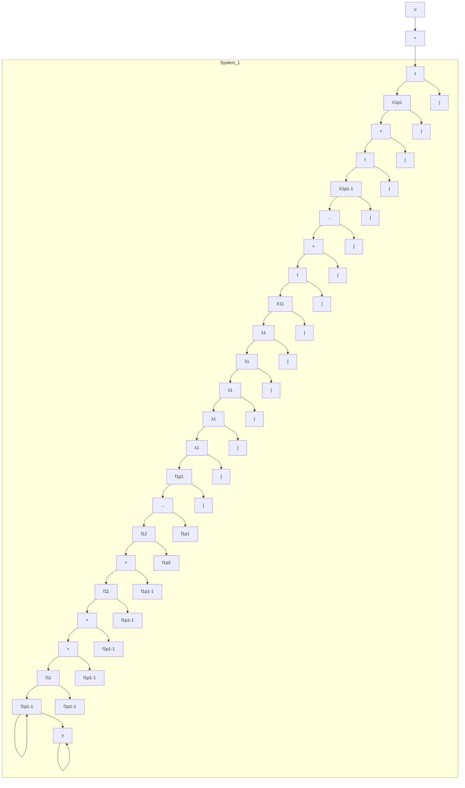

$$
A = \left[ \begin{array}{c c c} \operatorname{Re} A _ {1} & \operatorname{Im} A _ {1} & 0 \\ - \operatorname{Im} A _ {1} & \operatorname{Re} A _ {1} & 0 \\ 0 & 0 & A _ {3} \end{array} \right], \boldsymbol {b} = \left[ \begin{array}{c} 2 \boldsymbol {b} _ {1} \\ 0 \\ \boldsymbol {b} _ {3} \end{array} \right], \mathbf {c} = [ \operatorname{Re} \mathbf {c} _ {1}, \operatorname{Im} \mathbf {c} _ {1}, \mathbf {c} _ {3} ] \tag {9.72}
$$

不难看出,这时实现 $(A,b,c)$ 中已不再含有任何复数元了。并联形实现的方块图如图9.3所示。

串联形实现 给定传递函数 $g(s)$ 如(9.52)所示，令 $\{z_{1},\cdots,z_{n-1}\}$ 和 $\{\lambda_{1},\cdots,\lambda_{n}\}$ 分别为其零点和极点，且将 $g(s)$ 表为

$$g (s) = \beta_ {n - 1} \frac {1}{(s - \lambda_ {n})} \prod_ {i = 1} ^ {n - 1} \frac {(s - z _ {i})}{(s - \lambda_ {i})} \tag {9.73}$$

则其串联形实现 $(\hat{A},\hat{b},\hat{c})$ 为

$$
\hat {A} = \left[ \begin{array}{c c c c c c c} \lambda_ {1} & & & & & \\ \lambda_ {2} - z _ {2} & \lambda_ {2} & \ddots & & & \\ \vdots & & & \ddots & \ddots & \\ \lambda_ {n - 1} - z _ {n - 1} & \dots & \lambda_ {n - 1} - z _ {n - 1} & \lambda_ {n - 1} & \\ 1 & & \dots & 1 & \lambda_ {n} \end{array} \right]
$$

flowchart

图9.3 传递函数 $g(s)$ 的并联形实现

$$
\hat {b} = \beta_ {n - 1} \left[ \begin{array}{c} \lambda_ {1} - z _ {1} \\ \lambda_ {2} - z _ {2} \\ \vdots \\ \lambda_ {n - 1} - z _ {n - 1} \\ 1 \end{array} \right], \hat {c} = [ 0, \dots , 0, 1 ] \tag {9.74}
$$

证 首先,由 $(\hat{A},\hat{b},\hat{c})$ 来导出对应的状态方程
