$$
\left\{ \begin{array}{l} \dot {x} _ {1} = \lambda_ {1} x _ {1} + \beta_ {n - 1} (\lambda_ {1} - z _ {1}) u, \\ \dot {x} _ {2} = \lambda_ {2} x _ {2} + (\lambda_ {2} - z _ {2}) (x _ {1} + \beta_ {n - 1} u), \\ \dots \dots \\ \dot {x} _ {n - 1} = \lambda_ {n - 1} x _ {n - 1} + (\lambda_ {n - 1} - z _ {n - 1}) (x _ {1} + \dots + x _ {n - 2} + \beta_ {n - 1} u), \\ \dot {x} _ {n} = \lambda_ {n} x _ {n} + (x _ {1} + \dots + x _ {n - 1} + \beta_ {n - 1} u) \end{array} \right. \tag {9.75}
$$

和输出方程

$$y = x _ {n} \tag {9.76}$$

再令各状态变量的初值为零，并对(9.75)和(9.76)取拉普拉斯变换后整理之，可得到

$$
\left\{ \begin{array}{l} X _ {1} (s) = \beta_ {n - 1} \frac {\left(\lambda_ {1} - z _ {1}\right)}{\left(s - \lambda_ {1}\right)} U (s) \\ X _ {2} (s) = \beta_ {n - 1} \frac {\left(\lambda_ {2} - z _ {2}\right) \left(s - z _ {1}\right)}{\left(s - \lambda_ {2}\right) \left(s - \lambda_ {1}\right)} U (s) \\ \dots \dots \\ X _ {n - 1} (s) = \beta_ {n - 1} \frac {\left(\lambda_ {n - 1} - z _ {n - 1}\right) \left(s - z _ {n - 2}\right) \cdots \left(s - z _ {1}\right)}{\left(s - \lambda_ {n - 1}\right) \left(s - \lambda_ {n - 2}\right) \cdots \left(s - \lambda_ {1}\right)} U (s) \\ X _ {n} (s) = \beta_ {n - 1} \frac {\left(s - z _ {n - 1}\right) \left(s - z _ {n - 2}\right) \cdots \left(s - z _ {1}\right)}{\left(s - \lambda_ {n}\right) \left(s - \lambda_ {n - 1}\right) \cdots \left(s - \lambda_ {1}\right)} U (s) \\ Y (s) = X _ {n} (s) \end{array} \right. \tag {9.77}
$$

于是，由此就即可导出

$$\frac {Y (s)}{U (s)} = \beta_ {n - 1} \frac {1}{(s - \lambda_ {n})} \prod_ {i = 1} ^ {n - 1} \frac {(s - z _ {i})}{(s - \lambda_ {i})} = g (s) \tag {9.78}$$

从而就完成了证明。

串联形实现的方块图如图 9.4 所示。可以看出，当 $g(s)$ 的极点和零点均为实数时，串联形实现可直接用于系统分析和仿真，而且组成简单和形式直观。但是，当极点或零点中包含共轭复数时，通常需先对串联形实现引入适当的等价变换，使系数矩阵的复数元实现实数化后，才可用于系统分析和仿真。

```mermaid
graph TD
    A["u"] --> B["βn-1"]
    B --> C["λ1-z1"]
    C --> D["+"]
    D --> E["∫"]
    E --> F["x1"]
    F --> G["+"]
    G --> H["λ2-z2"]
    H --> I["+"]
    I --> J["∫"]
    J --> K["x2"]
    K --> L["+"]
    L --> M["λn"]
    M --> N["∫"]
    N --> O["xn"]
    O --> P["y"]
    P --> Q["λn-1"]
    Q --> R["+"]
    R --> S["∫"]
    S --> T["xn-1"]
    T --> U["+"]
    U --> V["λn-1"]
    V --> W["+"]
    W --> X["λ1"]
    X --> Y["+"]
    Y --> Z["λ2"]
```

flowchart

图 9.4 传递函数 $g(s)$ 的串联形实现
