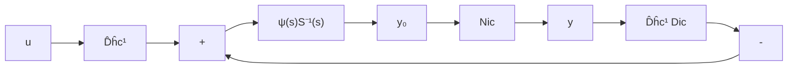

$$
\left\{ \begin{array}{c} S (s) \hat {\xi} (s) = \hat {u} _ {o} (s) \\ \hat {y} _ {o} (s) = \Psi (s) \hat {\xi} (s) \end{array} \right. \tag {9.103}
$$

且其相应的核 MFD 为 $\varPsi(s)S^{-1}(s)$ ; 而外围部分为

$$
\left\{ \begin{array}{l} \hat {\boldsymbol {u}} _ {o} (s) = - D _ {h c} ^ {- 1} D _ {l c} \hat {\boldsymbol {y}} _ {o} (s) + D _ {h c} ^ {- 1} \hat {\boldsymbol {u}} (s) \\ \hat {\boldsymbol {y}} (s) = N _ {l c} \hat {\boldsymbol {y}} _ {o} (s) \end{array} \right. \tag {9.104}
$$

于是，由式(9.103)和(9.104)即可导出等价的结构图，如图9.5所示。

从图9.5的结构图可以看出，由 $N(s)D^{-1}(s)$ 构造控制器形实现 $(A_{c}, B_{c}, C_{c})$ 的过

flowchart

图9.5 $N(s)D^{-1}(s)$ 的结构图

text_image

输入
u₀
{
    □□□□□□□□□□□□□□□□□□□□□□□□□□□□□□□□□□□□□□□□□□□□□□□□□□□□□□□□□□□□□□□□□□□□□□□□□□□□□□□□□□□□□□□□□□□□□□□□□□□□□
    □□□□□□□□□□□□□□□□□□□□□□□□□□□□
    □   □   □   □   □   □   □   □   □   □
    □   □   □   □   □   □   □   □   □   □
    □   □   □   □   □   □   □   □   □   □
}
输出
y₀

图9.6 等价于 $\Psi(s)S^{-1}(s)$ 的积分链

程可分成两步来进行：第一步，对核 MFD $\Psi(s)S^{-1}(s)$ ，也即对核心部分(9.103)来构造实现 $(A_{c}^{o}, B_{c}^{o}, C_{c}^{o})$ ，将其称之为 $N(s)D^{-1}(s)$ 的核实现。第二步，根据核实现 $(A_{c}^{o}, B_{c}^{o}, C_{c}^{o})$ ，再由结构图来导出整个控制器形实现 $(A_{c}, B_{c}, C_{c})$ 。

核实现 $(A_{c}^{o}, B_{c}^{o}, C_{c}^{o})$ 的构造 为了更清晰和更形象地说明核实现的构造过程, 我们下面分成五点来加以阐明:

（1）对于部分状态向量 $\xi$ 的每个分量 $\xi_{i}(i=1,\cdots,p)$ ，假设其最高阶导数 $\xi_{i}^{(k_{i})}\triangle d^{k_{i}}\xi_{i}/dt^{k_{i}}$ 是可以利用的，那么通过逐次积分就可得到其各个低阶导数：

$$\xi_ {i} ^ {(k _ {i} - 1)} = \int \xi_ {i} ^ {(k _ {i})} d t, \dots , \xi_ {i} = \int \xi_ {i} ^ {(1)} d t \tag {9.105}$$

显然，这个运算过程可通过引入由 $k_{i}$ 个积分器串接组成的一个积分链来实现，链的输入即为 $\xi_{i}^{(k_{i})}$ ，而各个积分器的输出 $\xi_{i}^{(k_{i}-1)},\cdots,\xi_{i}$ 构成链的输出。

（2）对于整个部分状态向量 $\pmb{\xi}$ ，则共需引入 $p$ 条积分链，每条积分链的长度（定义为组成链的积分器的个数）为列次数 $k_{i}$ ，它们组成了完整的运算线路。不失一般性，设 $k_{i}$ 是非降的，即

$$k _ {1} \leqslant k _ {2} \leqslant \dots \leqslant k _ {p} \tag {9.106}$$

那么这个积分链组就可按图 9.6 那样表示。

(3) 令 $\xi_{i}(s)$ 为 $\xi_{i}$ 的拉普拉斯变换, 则可容易看出, 这个积分链组的输入的拉普拉斯变换为
