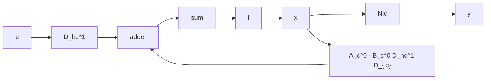

证 首先, 在图 9.5 的结构图中用核实现 $(A_{c}^{o}, B_{c}^{o}, C_{c}^{o})$ 来取代核 MFD $\Psi(s)S^{-1}(s)$ , 可导出时间域内的实现结构图, 如图 9.7 所示。再之, 对图 9.7 进行结构图化简, 可进而导出图 9.8。于是, 由此即得 (9.113)。并且, 由于 $(A_{c}^{o}, B_{c}^{o})$ 为能控, 且反馈不改变系统的能控性, 所以进一步又可知 $(A_{c}, B_{c})$ 为能控。从而, 结论得证。


<details>
<summary>flowchart</summary>

```mermaid
graph LR
    u --> D_hc^-1
    D_hc^-1 --> add1["+"]
    add1 --> B_c^0
    B_c^0 --> add2["+"]
    add2 --> integrator["∫"]
    integrator --> C_c^0
    C_c^0 --> y0
    y0 --> N_Lc
    N_Lc --> y
    y --> A_c^0
    A_c^0 --> add1
    add1 --> sum1["+"]
    sum1 --> B_c^0
    B_c^0 --> add2
    add2 --> integrator
    D_hc^-1 --> D_Lc
```
</details>

图 9.7 控制器形实现的结构图


<details>
<summary>flowchart</summary>


</details>

图 9.8 图 9.7 简化后的结构图

推论1 由核实现 $(A_{c}^{o}, B_{c}^{o}, C_{c}^{o})$ 的形式(9.112)可导出 $(A_{c}, B_{c}, C_{c})$ 必具有如

下的形式：

$$
A _ {c} = \left[ \begin{array}{c c c c c c c c c} * & \dots & * & * & \dots & * \\ 1 & 0 & & & & & & & \\ \ddots & \ddots & \ddots & & 0 & & & & \\ & 1 & 0 & & & & & & \\ \hline * & \dots & * & & & & & & \\ & 0 & & \ddots & & & & & \\ \hline & & & & \ddots & & & & \\ & \vdots & & & & & & \\ & \vdots & & & & & & \\ & \vdots & & & & & & \\ \hline k _ {1} & & & & k _ {p} \end{array} \right] \Bigg \} k _ {1} B _ {c} = \left[ \begin{array}{c c c c c c c c c} * & \dots & * \\ 0 \\ \hline - - - - - - - - - - - - - - - - - - - - - - - - - - - - - - - - - - - - - - - - - - - - - - - - - - - - - - - - - - - - - - - - - - - - - - - - - - - - - - - - - - - - - - - - - - - - - - - - - - - - 0 p ^ {p} \end{array} \right] k _ {p}
$$

$C_{c} = N_{lc}$ 无特别的形式 (9.114)

其中，由“\*”表示的元为可能的非零元。

推论2 由关系式(9.113)进一步可知： $A_{c}$ 中的第i个\*行等同于 $-D_{bc}^{-1}D_{lc}$ 的第i行， $B_{c}$ 中的第i个\*行则等同于 $D_{bc}^{-1}$ 的第i行， $i=1,2,\cdots,p_{0}$

例 给定 $N(s)D^{-1}(s)$ ，其中

$$
N (s) = \left[ \begin{array}{l l} s & 0 \\ - s & s ^ {2} \end{array} \right], \quad D (s) = \left[ \begin{array}{c c} 0 & - (s ^ {3} + 4 s ^ {2} + 5 s + 2) \\ (s + 2) ^ {2} & s + 2 \end{array} \right]
$$

容易判断， $D(s)$ 是列既约的，且 $N(s)D^{-1}(s)$ 为严格真的。再因 $k_{1} = \delta_{c1}D(s) = 2$ ， $k_{2} = \delta_{c2}D(s) = 3$ ，故可以定出：

$$
D _ {k e} = \left[ \begin{array}{c c} 0 & - 1 \\ 1 & 0 \end{array} \right], \quad D _ {l e} = \left[ \begin{array}{c c c c c} 0 & 0 & - 4 & - 5 & - 2 \\ 4 & 4 & 0 & 1 & 2 \end{array} \right]
