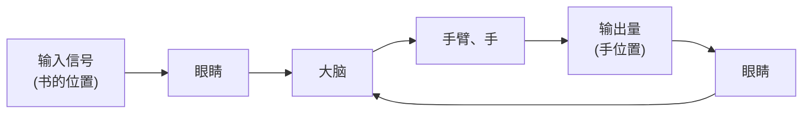

# 3. 反馈控制原理

为了实现各种复杂的控制任务,首先要将被控对象和控制装置按照一定的方式连接起来,组成一个有机总体,这就是自动控制系统。在自动控制系统中,被控对象的输出量(被控量)是要求严格加以控制的物理量,它可以要求保持为某一恒定值,如温度、压力、液位等,也可以要求按照某个给定规律运行,如飞行航迹、记录曲线等;而控制装置则是对被控对象施加控制作用的机构的总体,它可以采用不同的原理和方式对被控对象进行控制,但最基本的一种是基于反馈控制原理组成的反馈控制系统。

在反馈控制系统中,控制装置对被控对象施加的控制作用,是取自被控量的反馈信息,用来不断修正被控量与输入量之间的偏差,从而实现对被控对象进行控制的任务,这就是反馈控制的原理。

其实，人的一切活动都体现出反馈控制的原理，人本身就是一个具有高度复杂控制能力的反馈控制系统。例如，人用手拿取桌上的书，汽车司机操纵方向盘驾驶汽车沿公路平稳行驶等，这些日常生活中习以为常的动作都渗透着反馈控制的深奥原理。下面，通过解剖手从桌上取书的动作过程，透视一下它所包含的反馈控制机理。在这里，书的位置是手运动的指令信息，一般称为输入信号。取书时，首先人要用眼睛连续目测手相对于书的位置，并将这个信息送入大脑（称为位置反馈信息）；然后由大脑判断手与书之间的距离，产生偏差信号，并根据其大小发出控制手臂移动的命令（称为控制作用或操纵量），逐渐使手与书之间的距离（偏差）减小。显然，只要这个偏差存在，上述过程就要反复进行，直到偏差减小为零，手便取到了书。可以看出，大脑控制手取书的过程，是一个利用偏差（手与书之间距离）产生控制作用，并不断使偏差减小直至消除的运动过程；同时，为了取得偏差信号，必须要有手位置的反馈信息，两者结合起来，就构成了反馈控制。显然，反馈控制实质上是一个按偏差进行控制的过程，因此，它也称为按偏差的控制，反馈控制原理就是按偏差控制的原理。

人取物视为一个反馈控制系统时,手是被控对象,手位置是被控量(即系统的输出量),产生控制作用的机构是眼睛、大脑和手臂,统称为控制装置。可以用图1-1的系统方块图来展示这个反馈控制系统的基本组成及工作原理。

通常，把取出输出量送回到输入端，并与输入信号相比较产生偏差信号的过程，称为反馈。若反馈的信号与输入信号相减，使产生的偏差越来越小，则称为负反馈；反之，则称为正反馈。反馈控制就是采用负反馈并利用偏差进行控制的过程，而且，由于引入了被控量的反馈信息，整个控制过程成为闭合过程，因此反馈控制也称闭环控制。

在工程实践中,为了实现对被控对象的反馈控制,系统中必须配置具有人的眼睛、大脑和手臂类似功能的设备,以便对被控量进行连续地测量、反馈和比较,并按偏差进行控制。这些设备依其功能分别称为测量元件、比较元件和执行元件,并统称为控制装置。

flowchart

图 1-1 人取书的反馈控制系统方块图

text_image

+
-
u0
Δu
FD
-K
uk
CF
KZ
ua
Ia
+
-
n
SM
u1
TG
+

图 1-2 龙门刨床速度控制系统原理图
