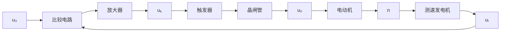

在工业控制中，龙门刨床速度控制系统就是按照反馈控制原理进行工作的。通常，当龙门刨床加工表面不平整的毛坯时，负载会有很大的波动，但为了保证加工精度和表面光洁度，一般不允许刨床速度变化过大，因此必须对速度进行控制。图1-2是利用速度反馈对刨床速度进行自动控制的原理图。图中，刨床主电动机SM是电枢控制的直流电动机，其电枢电压由晶闸管整流装置KZ提供，并通过调节触发器CF的控制电压 $u_{k}$ ，来改变电动机的电枢电压，从而改变电动机的速度（被控量）。测速发电机TG是测量元件，用来测量刨床速度并给出与速度成正比的电压 $u_{t}$ 。然后，将 $u_{t}$ 反馈到输入端并与给定电压 $u_{0}$ 反向串联便得到偏差电压 $\Delta u=u_{0}-u_{t}$ 。在这里， $u_{0}$ 是根据刨床工作情况预先设置的速度给定电压，它与反馈电压 $u_{t}$ 相减便形成偏差电压 $\Delta u$ ，因此 $u_{t}$ 称为负反馈电压。一般，偏差电压比较微弱，需经放大器FD放大后才能作为触发器的控制电压。在这个系统中，被控对象是电动机，触发器和整流装置起了执行控制动作的作用，故称为执行元件。现在具体分析一下刨床速度自动控制的过程。当刨床正常工作时，对于某给定电压 $u_{0}$ , 电动机必有确定的速度给定值 $n$ 相对应, 同时亦有相应的测速发电机电压 $u_{i}$ , 以及相应的偏差电压 $\Delta u$ 和触发器控制电压 $u_{k}$ 。如果刨床负载变化, 如增加负载, 将使速度降低而偏离给定值, 同时, 测速发电机电压 $u_{i}$ 将相应减小, 偏差电压 $\Delta u$ 将因此增大, 触发器控制电压 $u_{k}$ 也随之增大, 从而使晶闸管整流电压 $u_{a}$ 升高, 逐步使速度回升到给定值附近。这个过程可用图1-3的一组曲线表明。由图可见, 负载 $M_{1}$ 在 $t_{1}$ 时突增为 $M_{2}$ , 致使电动机速度由给定值 $n_{1}$ 急剧下降。但随着 $\Delta u$ 和 $u_{a}$ 的增大, 速度很快回升, $t_{2}$ 时速度便回升到 $n_{2}$ , 它与给定值 $n_{1}$ 已相差无几了。反之, 如果刨床速度因减小负载致使速度上升, 则各电压量反向变化, 速度回落过程完全一样。另外, 如果调整给定电压 $u_{0}$ , 便可改变刨床工作速度。因此, 采用图1-2的自动控制系统, 既可以在不同负载下自动维持刨床速度不变, 也可以根据需要自动地改变刨床速度, 其工作原理都是相同的。它们都是由测量元件(测速发电机)对被控量(速度)进行检测, 将被控量反馈至比较电路并与给定值相减而得到偏差电压(速度负反馈), 经放大器放大、变换后, 执行元件(触发器和晶闸管整流装置)便依据偏差电压的性质对被控量(速度)进行相应调节,从而使偏差消失或减小到允许范围。可见,这是一个由负反馈产生偏差,并利用偏差进行控制直到最后消除偏差的过程,这就是负反馈控制原理,简称反馈控制原理。

line

| Time | Magnetization (M) | Magnetic Field (n) | Inductance (Δu) | Voltage (Δu) |
| --- | --- | --- | --- | --- |
| t1 | M1 | n1 | Δu1 | Δu2 |
| t2 | M2 | n2 | Δu2 | Δu2 |
| t1 | uα | uα | uα | uα₂ |

图 1-3 龙门刨床速度自动控制过程

应当指出的是, 图 1-2 的刨床速度控制系统是一个有静差系统。由图 1-3 的速度控制过程曲线可以看出, 速度最终达到的稳态值 $n_2$ 与原给定速度 $n_1$ 之间始终有一个差值存在, 这个差值是用来产生一个附加的电动机电枢电压, 以补偿因增加负载而引起的速度下降。因此, 差值的存在是保证系统正常工作所必需的, 一般称为稳态误差。如果从结构上加以改进, 这个稳态误差是可以消除的。

图 1-4 是与图 1-2 对应的刨床速度控制系统方块图。在方块图中，被控对象和控制装置的各元部件(硬件)分别用一些方块表示。系统中感兴趣的物理量(信号)，如电流、电压、温度、位置、速度、压力等，标志在信号线上，其流向用箭头表示。用进入方块的箭头表示各元部件的输入量，用离开方块的箭头表示其输出量，被控对象的输出量便是系统的输出量，即被控量，一般置于方块图的最右端；系统的输入量，一般置于系统方块图的左端。

flowchart

图 1-4 龙门刨床速度控制系统方块图
