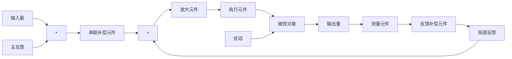

# 4. 反馈控制系统的基本组成

反馈控制系统是由各种结构不同的元部件组成的。从完成“自动控制”这一职能来看，一个系统必然包含被控对象和控制装置两大部分，而控制装置是由具有一定职能的各种基本元件组成的。在不同系统中，结构完全不同的元部件却可以具有相同的职能，因此，将组成系统的元部件按职能分类主要有以下几种：

测量元件 其职能是检测被控制的物理量,如果这个物理量是非电量,一般要再转换为电量。例如,测速发电机用于检测电动机轴的速度并转换为电压;电位器、旋转变压器或自整角机用于检测角度并转换为电压;热电偶用于检测温度并转换为电压等。

给定元件 其职能是给出与期望的被控量相对应的系统输入量。例如图 1-2 中给出电压 $u_{0}$ 的电位器。

比较元件 其职能是把测量元件检测的被控量实际值与给定元件给出的输入量进行比较，求出它们之间的偏差。常用的比较元件有差动放大器、机械差动装置、电桥电路等。图1-2中，由于给定电压 $u_{0}$ 和反馈电压 $u_{t}$ 都是直流电压，故只需将它们反向串联便可得到偏差电压。

放大元件 其职能是将比较元件给出的偏差信号进行放大,用来推动执行元件去控制被控对象。电压偏差信号可用集成电路、晶闸管等组成的电压放大级和功率放大级加以放大。

执行元件 其职能是直接推动被控对象,使其被控量发生变化。用来作为执行元件的有阀、电动机、液压马达等。

校正元件 也叫补偿元件, 它是结构或参数便于调整的元部件, 用串联或反馈的方式连接在系统中, 以改善系统的性能。最简单的校正元件是由电阻、电容组成的无源或有源网络, 复杂的则用计算机。

一个典型的反馈控制系统基本组成可用图 1-5 所示的方块图表示。图中，“○”代表比较元件, 它将测量元件检测到的被控量与输入量进行比较, 负号(一)表示两者符号相反, 即负反馈; 正号(+)表示两者符号相同, 即正反馈。信号从输入端沿箭头方向到达输出端的传输通路称前向通路; 系统输出量经测量元件反馈到输入端的传输通路称主反馈通路。前向通路与主反馈通路共同构成主回路。此外, 还有局部反馈通路以及由它构成的内回路。只包含一个主反馈通路的系统称单回路系统; 有两个或两个以上反馈通路的系统称多回路系统。

flowchart

图1-5 反馈控制系统基本组成

一般, 加到反馈控制系统上的外作用有两种类型, 一种是有用输入, 一种是扰动。有用输入决定系统被控量的变化规律, 如输入量; 而扰动是系统不希望有的外作用, 它破坏有用输入对系统的控制。在实际系统中, 扰动总是不可避免的, 而且它可以作用于系统中的任何元部件上, 也可能一个系统同时受到几种扰动作用。电源电压的波动, 环境温度、压力以及负载的变化, 飞行中气流的冲击, 航海中的波浪等, 都是现实中存在的扰动。在图 1-2 的速度控制系统中, 切削工件外形及切削量的变化就是一种扰动, 它直接影响电动机的负载转矩, 并进而引起刨床速度的变化。
