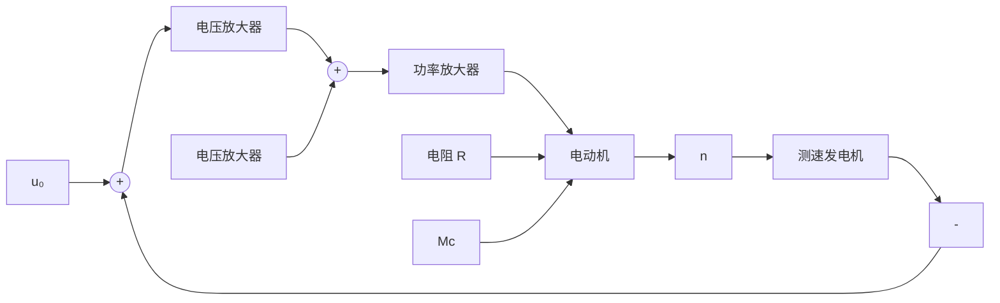

# (3) 复合控制方式

按扰动控制方式在技术上较按偏差控制方式简单,但它只适用于扰动是可测量的场合,而且一个补偿装置只能补偿一种扰动因素,对其余扰动均不起补偿作用。因此,比较合理的一种控制方式是把按偏差控制与按扰动控制结合起来,对于主要扰动采用适当的补偿装置实现按扰动控制,同时,再组成反馈控制系统实现按偏差控制,以消除其余扰动产生的偏差。这样,系统的主要扰动已被补偿,反馈控制系统就比较容易设计,控制效果也会更好。这种按偏差控制和按扰动控制相结合的控制方式称为复合控制方式。图 1-7 表示一种同时按偏差和扰动控制电动机速度的复合控制系统原理线路图和方块图。

text_image

电压放大
+
-
u0
u1
+
-
功率放大
+
-
ua
R
i
SM
n
负载
电压放大
+
-
(a) 原理图

图 1-7 电动机速度复合控制系统

flowchart

(b) 方框图  
图 1-7 电动机速度复合控制系统(续)
