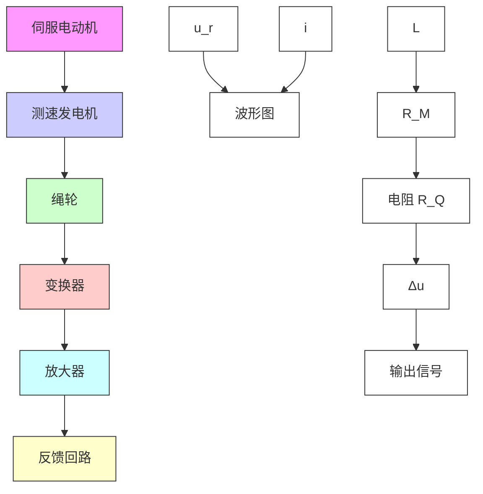
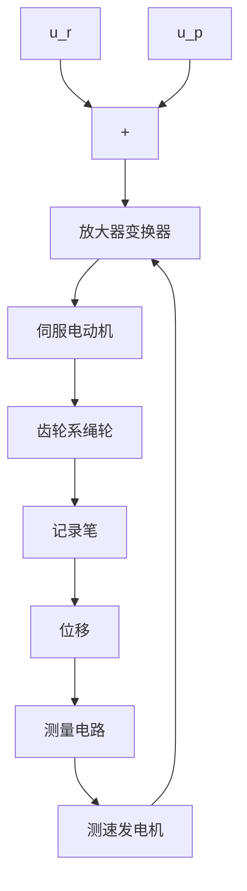

# 1. 函数记录仪

函数记录仪是一种通用的自动记录仪,它可以在直角坐标上自动描绘两个电量的函数关系。同时,记录仪还带有走纸机构,用以描绘一个电量对时间的函数关系。

函数记录仪通常由衰减器、测量元件、放大元件、伺服电动机-测速机组、齿轮系及绳轮等组成，采用负反馈控制原理工作，其原理如图1-8所示。系统的输入是待记录电压，被控对象是记录笔，其位移即为被控量。系统的任务是控制记录笔位移，在记录纸上描绘出待记录的电压曲线。

flowchart

图 1-8 函数记录仪原理示意图

在图1-8中，测量元件是由电位器 $R_{Q}$ 和 $R_{M}$ 组成的桥式测量电路，记录笔就固定在电位器 $R_{M}$ 的滑臂上，因此，测量电路的输出电压 $u_{p}$ 与记录笔位移成正比。当有慢变的输入电压 $u_{r}$ 时，在放大元件输入口得到偏差电压 $\Delta u = u_r - u_p$ ，经放大后驱动伺服电动机，并通过齿轮系及绳轮带动记录笔移动，同时使偏差电压减小。当偏差电压 $\Delta u = 0$ 时，电动机停止转动，记录笔也静止不动。此时， $u_{p} = u_{r}$ ，表明记录笔位移与输入电压相对应。如果输入电压随时间连续变化，记录笔便描绘出随时间连续变化的相应曲线。函数记录仪方块图如图1-9所示，图中测速发电机反馈与电动机速度成正比的电压，用以增加阻尼，改善系统性能。

flowchart

图 1-9 函数记录仪方块图
