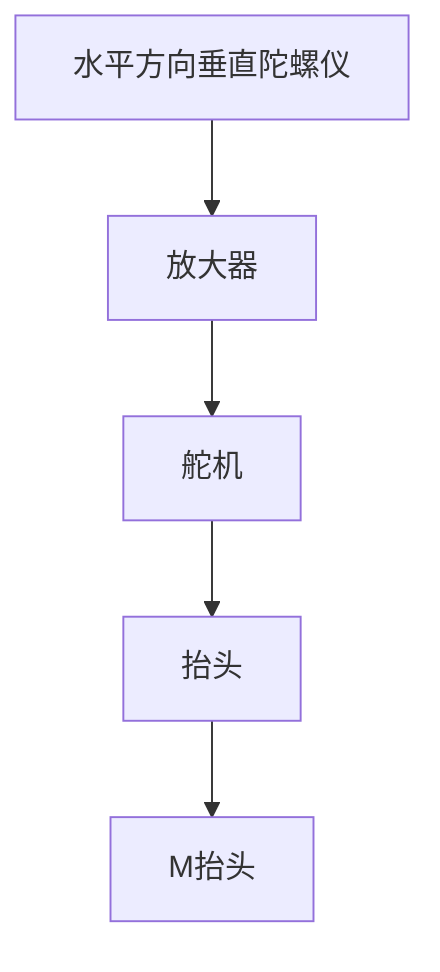
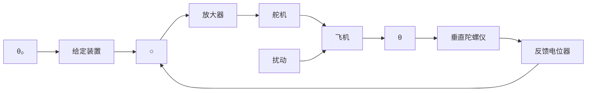

# 2. 飞机-自动驾驶仪系统

飞机自动驾驶仪是一种能保持或改变飞机飞行状态的自动装置。它可以稳定飞行的姿态、高度和航迹；可以操纵飞机爬高、下滑和转弯。飞机与自动驾驶仪组成的自动控制系统称为飞机-自动驾驶仪系统。

如同飞行员操纵飞机一样，自动驾驶仪控制飞机飞行是通过控制飞机的三个操纵面（升降舵、方向舵、副翼）的偏转，改变舵面的空气动力特性，以形成围绕飞机质心的旋转转矩，从而改变飞机的飞行姿态和轨迹。现以比例式自动驾驶仪稳定飞机俯仰角为例，说明其工作原理。图1-10为飞机-自动驾驶仪系统稳定俯仰角的原理示意图。

flowchart

图 1-10 飞机-自动驾驶仪系统原理图

图中，垂直陀螺仪作为测量元件用以测量飞机的俯仰角，当飞机以给定俯仰角水平飞行时，陀螺仪电位器没有电压输出；如果飞机受到扰动，使俯仰角向下偏离期望值，陀螺仪电位器输出与俯仰角偏差成正比的信号，经放大器放大后驱动舵机，一方面推动升降舵面向上偏转，产生使飞机抬头的转矩，以减小俯仰角偏差；同时还带动反馈电位器滑臂，输出与舵偏角成正比的电压并反馈到输入端。随着俯仰角偏差的减小，陀螺仪电位器

输出信号越来越小，舵偏角也随之减小，直到俯仰角回到期望值，这时，舵面也恢复到原来状态。

图 1-11 是飞机-自动驾驶仪系统稳定俯仰角的系统方块图。图中，飞机是被控对象，俯仰角是被控量，放大器、舵机、垂直陀螺仪、反馈电位器等是控制装置，即自动驾驶仪。输入量是给定的常值俯仰角，控制系统的任务就是在任何扰动（如阵风或气流冲击）作用下，始终保持飞机以给定俯仰角飞行。

flowchart

图 1-11 俯仰角控制系统方块图
