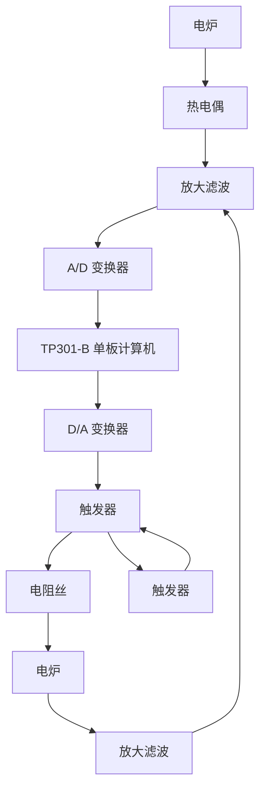

# 3. 电阻炉温度微型计算机控制系统

用于工业生产中炉温控制的微型计算机控制系统，具有精度高、功能强、经济性好、无噪声、显示醒目、读数直观、打印存档方便、操作简单、灵活性和适应性好等一系列优点。用微型计算机控制系统代替模拟式控制系统是今后工业过程控制的发展方向。图1-12为某工厂电阻炉温度微型计算机控制系统原理示意图。图中，电阻丝通过晶闸管主电路加热，炉温期望值用计算机键盘预先设置，炉温实际值由热电偶检测，并转换成电压，经放大、滤波后，由A/D变换器将模拟量变换为数字量送入计算机，在计算机中与所设置的温度期望值比较后产生偏差信号，计算机便根据预定的控制算法(即控制规律)计算出相应的控制量，再经D/A变换器变换成电流，通过触发器控制晶闸管导通角，从而改变电阻丝中电流大小，达到控制炉温的目的。该系统既有精确的温度控制功能，还有实时屏幕显示和打印功能，以及超温、极值和电阻丝、热电偶损坏报警等功能。

flowchart

图 1-12 电阻炉温度微型计算机控制系统
