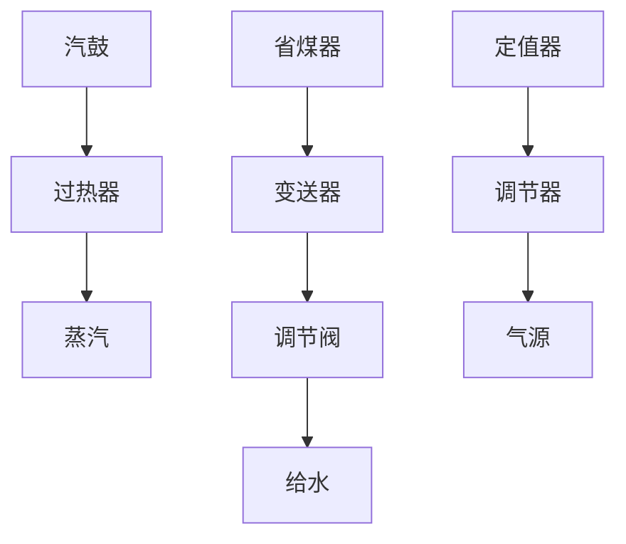
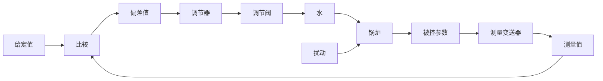

# 4. 锅炉液位控制系统

锅炉是电厂和化工厂里常见的生产蒸汽的设备。为了保证锅炉正常运行，需要维持锅炉液位为正常标准值。锅炉液位过低，易烧干锅而发生严重事故；锅炉液位过高，则易使蒸汽带水并有溢出危险。因此，必须通过调节器严格控制锅炉液位的高低，以保证锅炉正常安全地运行。常见的锅炉液位控制系统示意图如图1-13所示。

flowchart

图 1-13 锅炉液位控制系统示意图

当蒸汽的耗汽量与锅炉进水量相等时，液位保持为正常标准值。当锅炉的给水量不变，而蒸汽负荷突然增加或减少时，液位就会下降或上升；或者，当蒸汽负荷不变，而给水管道水压发生变化时，引起锅炉液位发生变化。不论出现哪种情况，只要实际液位高度与正常给定液位之间出现了偏差，调节器均应立即进行控制，去开大或关小给水阀门，使液位恢复到给定值。

图1-14是锅炉液位控制系统方块图。图中，锅炉为被控对象，其输出为被控参数液位，作用于锅炉上的扰动是指给水压力变化或蒸汽负荷变化等产生的内外扰动；测量变送器为差压变送器，用来测量锅炉液位，并转变为一定的信号输至调节器；调节器是锅炉液位控制系统中的控制器，有电动、气动等形式，在调节器内将测量液位与给定液位进行比较，得出偏差值，然后根据偏差情况按一定的控制律[如比例(P)、比例-积分(PI)、比例-积分-微分(PID)等]发出相应的输出信号去推动调节阀动作；调节阀在控制系统中起执行元件作用，根据控制信号对锅炉的进水量进行调节，阀门的运动取决于阀门的特性，有的阀门与输入信号成正比变化，有的阀门与输入信号呈某种曲线关系变化。大多数调节阀为气动薄膜调节阀，若采用电动调节器，则调节器与气动调节阀之间应有电气转换器。气动调节阀的气动阀门分为气开与气关两种。气开阀指当调节器输出增加时，阀门开大；气关阀指当调节器输出增加时，阀门反而关小。为了安全生产，蒸汽锅炉的给水调节阀一般采用气关阀，一旦发生断气现象，阀门保持打开位置，以保证汽鼓不被烧干损坏。

flowchart

图1-14 锅炉液位控制系统方块图
