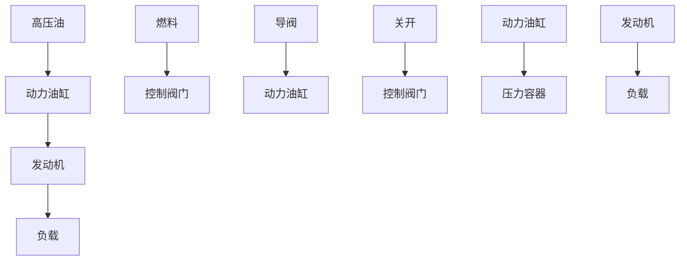

# 5. 转速控制系统

发动机转速控制系统的原理图如图1-15所示，图中展示了发动机瓦特式速度调节器的基本原理。允许进入发动机内的燃料数量，可由希望的发动机转速与实际的发动机转速之差进行调整。

该系统的工作过程陈述如下:转速调节器的调节原理是当发动机工作于希望的转速时,高压油将不进入动力油缸的任何一侧。如果由于扰动,使得实际转速下降到低于希望值,则转速调节器的离心力下降,导致控制阀向下移动,从而对发动机的燃料供应增多,使发动机的转速增大,直至希望的转速时为止。另一方面,如果发动机的转速增大,以至于超过了希望的转速值,则转速调节器的离心力增大,从而导致控制阀向上移动。这样会减少燃料供应,导致发动机的转速减慢,直至希望的转速时为止。

在这个转速控制系统中,被控对象是发动机,而被控变量是发动机的转速。希望转速与实际转速之间的差形成误差信号,作用到对象(发动机)上的控制信号(燃料的数量)为驱动信号,对被控变量起干扰作用的外部输入量称为扰动量。不能预测的负载变化就是一种扰动量。

flowchart

图 1-15 转速控制系统原理图
