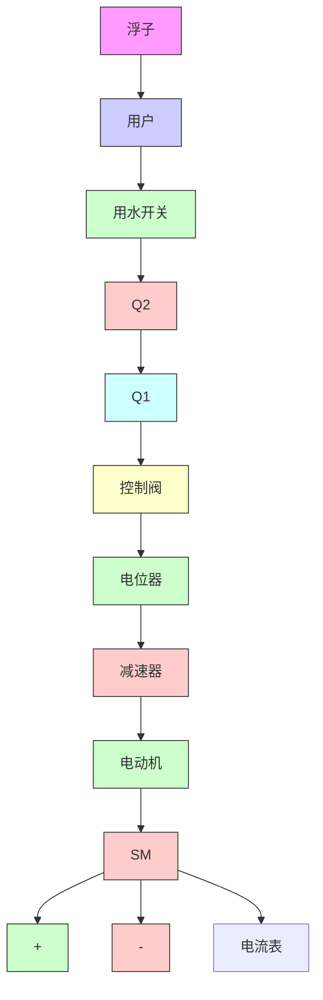
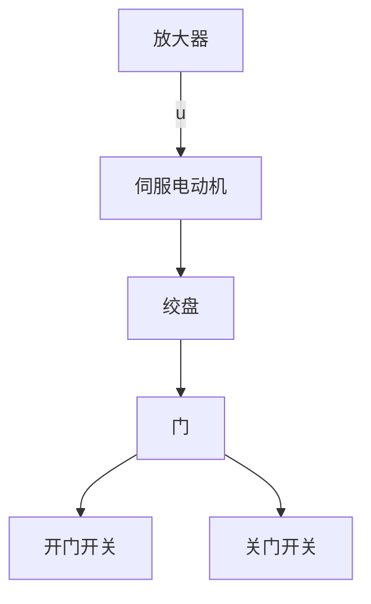
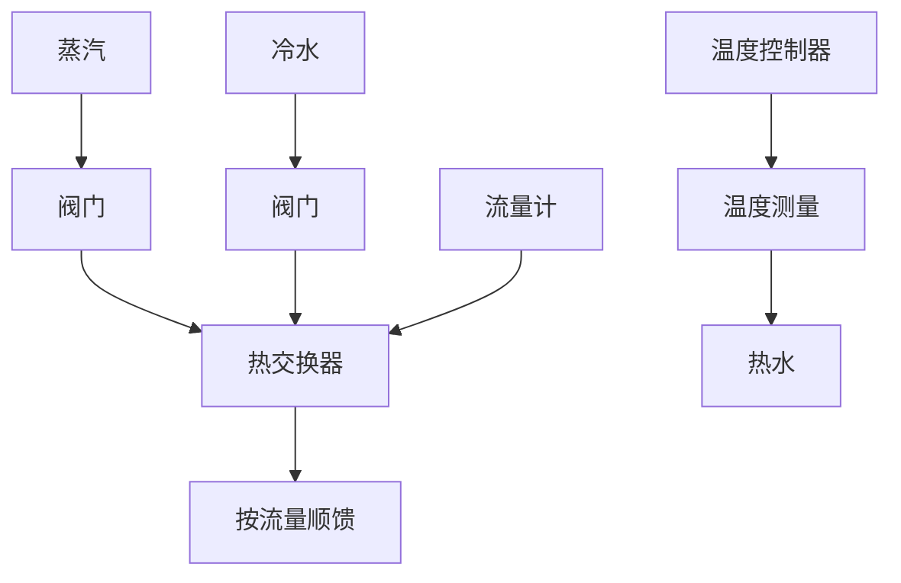

# 习题

1-1 图 1-21 是液位自动控制系统原理示意图。在任意情况下，希望液面高度 c 维持不变，试说明系统工作原理并画出系统方块图。

flowchart

图 1-21 液位自动控制系统

flowchart

图 1-22 仓库大门自动开闭控制系统

1-2 图 1-22 是仓库大门自动控制系统原理示意图。试说明系统自动控制大门开闭的工作原理并画出系统方块图。  
1-3 图 1-23(a) 和 (b) 均为自动调压系统。设空载时, 图 (a) 与图 (b) 的发电机端电压均为 110V。试问带上负载后, 图 (a) 与图 (b) 中哪个系统能保持 110V 电压不变? 哪个系统的电压会稍低于 110V? 为什么?

text_image

+
uf
if
G
负载
SM
K

(a)

text_image

If
+
-
负载
Δ K
+

(b)   
图 1-23 自动调压系统

1-4 图 1-24 为水温控制系统示意图。冷水在热交换器中由通入的蒸汽加热，从而得到一定温度的热水。冷水流量变化用流量计测量。试绘制系统方块图，并说明为了保持热水温度为期望值，系统是如何工作的？系统的被控对象和控制装置各是什么？

1-5 图 1-25 是电炉温度控制系统原理示意图。试分析系统保持电炉温度恒定的工作过程，指出系统的被控对象、被控量以及各部件的作用，最后画出系统方块图。

flowchart

图 1-24 水温控制系统示意图

flowchart

