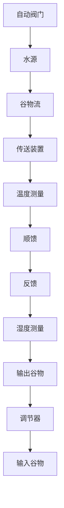

图 1-25 电炉温度控制系统原理图

1-6 图 1-26 是自整角机随动系统原理示意图。系统的功能是使接收自整角机 TR 的转子角位移 $\theta_{o}$ 与发送自整角机 TX 的转子角位移 $\theta_{i}$ 始终保持一致。试说明系统是如何工作的，并指出被控对象、被控量以及控制装置各部件的作用，画出系统方块图。

flowchart

图 1-26 自整角机随动系统原理图

1-7 在按扰动控制的开环控制系统中,为什么说一种补偿装置只能补偿一种与之相应的扰动因素?对于图 1-6 所示的按扰动控制的速度控制系统,当电动机的激磁电压变化时,转速如何变化?该补偿装置能否补偿这个转速的变化?

flowchart

图 1-27 谷物湿度控制系统

1-8 图 1-27 为谷物湿度控制系统示意图。在谷物磨粉的生产过程中，有一种出粉最多的湿度，因此磨粉之前要给谷物加水以得到给定的湿度。图中，谷物用传送装置按一定流量通过加水点，加水量由自动阀门控制。加水过程中，谷物流量、加水前谷物湿度以及水压都是对谷物湿度控制的扰动作用。为了提高控制精度，系统中采用了谷物湿度的顺馈控制，试画出系统方块图。

1-9 图 1-28 为数字计算机控制的机床刀具进给系统。要求将工件的加工过程编制成程序预先存入计算机，加工时，步进电动机按照计算机给出的信息动

作,完成加工任务。试说明该系统的工作原理。

flowchart

图 1-28 机床刀具进给系统

1-10 下列各式是描述系统的微分方程, 其中 $c(t)$ 为输出量, $r(t)$ 为输入量, 试判断哪些是线性定常或时变系统, 哪些是非线性系统?

(1) $c(t) = 5 + r^2 (t) + t\frac{\mathrm{d}^2r(t)}{\mathrm{d}t^2};$   
(2) $\frac{\mathrm{d}^3c(t)}{\mathrm{dt}^3} + 3\frac{\mathrm{d}^2c(t)}{\mathrm{dt}^2} + 6\frac{\mathrm{dc}(t)}{\mathrm{dt}} + 8c(t) = r(t)$ ;   
(3) $t\frac{\mathrm{d}c(t)}{\mathrm{d}t} + c(t) = r(t) + 3\frac{\mathrm{d}r(t)}{\mathrm{d}t};$   
(4) $c(t) = r(t)\cos \omega t + 5$ ;   
(5) $c(t) = 3r(t) + 6\frac{\mathrm{d}r(t)}{\mathrm{d}t} + 5\int_{-\infty}^{t}r(\tau)\mathrm{d}\tau ;$   
(6) $c(t) = r^2 (t)$ ;   
(7) $c(t) = \begin{cases} 0, & t < 6, \\ r(t), & t \geqslant 6. \end{cases}$
