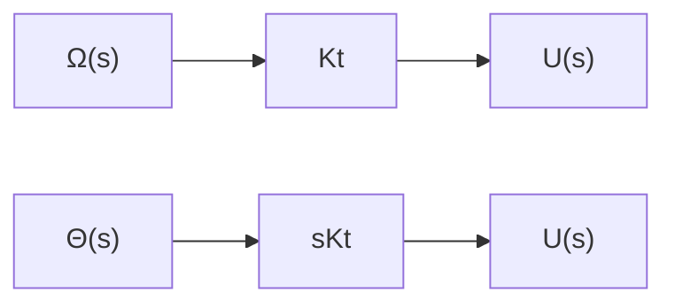

可见，由于负载电阻 $R_{t}$ 的影响，输出电压 $u(t)$ 与电刷角位移 $\theta (t)$ 不再保持线性关系，因而也求不出电位器的传递函数。但是，如果负载电阻 $R_{l}$ 很大，如 $R_{l} \geqslant 10R_{p}$ 时，可以近似得到 $u(t) \approx E\theta(t)/\theta_{\max} = K_{1}\theta(t)$ 。因此，当电位器接负载时，只是在负载阻抗足够大时，才能将电位器视为线性元件，其输出电压与电刷角位移之间才有线性关系。

测速发电机 测速发电机是用于测量角速度并将它转换成电压量的装置。在控制系统中常用的有直流和交流测速发电机，如图2-12所示。图2-12(a)是永磁式直流测速发电机的原理线路图。测速发电机的转子与待测量的轴相连接，在电枢两端输出与转子角速度成正比的直流电压，即

$$u (t) = K _ {t} \omega (t) = K _ {t} \frac {\mathrm{d} \theta (t)}{\mathrm{d} t} \tag {2-46}$$

text_image

u(t)
TG
(a)
ω
ω
TG
~
u(t)
(b)

图 2-12 测速发电机示意图

式中， $\theta(t)$ 是转子角位移； $\omega(t) = \mathrm{d}\theta(t) / \mathrm{d}t$ 是转子角速度； $K_{t}$ 是测速发电机输出斜率，表示单位角速度的输出电压。在零初始条件下，对式(2-46)求拉氏变换可得直流测速发电机的传递函数为

$$G (s) = \frac {U (s)}{\Omega (s)} = K _ {t} \tag {2-47}$$

或

$$G (s) = \frac {U (s)}{\Theta (s)} = K _ {t} s \tag {2-48}$$

式中， $U(s) = \mathcal{L}[u(t)];\Theta (s) = \mathcal{L}[\theta (t)];\Omega (s) = \mathcal{L}[\omega (t)]$ 。式(2-47)和式(2-48)可分别用图2-13中的两个方框图表示。

flowchart

图 2-13 测速发电机的方框图

图 2-12(b) 是交流测速发电机的示意图。在结构上它有两个互相垂直放置的线圈，其中一个是激磁绕组，接入一定频率的正弦额定电压，另一个是输出绕组。当转子旋转时，输出绕组产生与转子角速度成比例的交流电压 $u(t)$ ，其频率与激磁电压频率相同，其包络线也可以用式(2-46)表示，因此其传递函数及方框图亦同直流测速发电机。

电枢控制直流伺服电动机 电枢控制的直流伺服电动机在控制系统中广泛用作执行机构，用来对被控对象的机械运动实现快速控制。根据式(2-39)和式(2-40)可用图2-14的方框图表示三种情况下的电枢控制直流伺服电动机。

flowchart

图 2-14 直流伺服电动机方框图

两相伺服电动机 两相伺服电动机具有重量轻、惯性小、加速特性好的优点，是控制系统中广泛应用的一种小功率交流执行机构。

两相伺服电动机由互相垂直配置的两相定子线圈和一个高电阻值的转子组成。定子线圈的一相是激磁绕组，另一相是控制绕组，通常接在功率放大器的输出端，提供数值和极性可变的交流控制电压。
