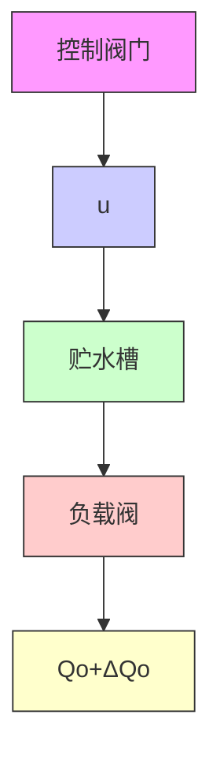

$$\frac {U _ {o} (s)}{U _ {i} (s)} = \frac {Z _ {2}}{Z _ {1} + Z _ {2}} = \frac {1}{L C s ^ {2} + R C s + 1}$$

应该注意,求取无源网络传递函数时,一般假设网络输出端接有无穷大负载阻抗,输入内阻为零,否则应考虑负载效应。例如,在图 2-17 中,两个 RC 网络不相连接时,可视为空载,其传递

函数分别是

$$G _ {1} (s) = \frac {U (s)}{U _ {i} (s)} = \frac {1}{R _ {1} C _ {1} s + 1}, \quad G _ {2} (s) = \frac {U _ {o} (s)}{U (s)} = \frac {1}{R _ {2} C _ {2} s + 1}$$

若将 $G_{1}(s)$ 与 $G_{2}(s)$ 两个方框串联连接，如图2-17右端，则其传递函数

$$
\begin{array}{l} \frac {U _ {o} (s)}{U _ {i} (s)} = \frac {U (s)}{U _ {i} (s)} \cdot \frac {U _ {o} (s)}{U (s)} = G _ {1} (s) G _ {2} (s) \\ = \frac {1}{R _ {1} R _ {2} C _ {1} C _ {2} s ^ {2} + (R _ {1} C _ {1} + R _ {2} C _ {2}) s + 1} \\ \end{array}
$$

text_image

R₁
u(t)
C₁ u(t)
G₁(s)
R₂
C₂ uₙ(t)
G₂(s)

flowchart

图 2-17 负载效应示例

若将两个 RC 网络直接连接,则由电路微分方程可求得连接后电路的传递函数为

$$G (s) = \frac {U _ {o} (s)}{U _ {i} (s)} = \frac {1}{R _ {1} R _ {2} C _ {1} C _ {2} s ^ {2} + \left(R _ {1} C _ {1} + R _ {2} C _ {2} + R _ {1} C _ {2}\right) s + 1}$$

显然， $G(s)\neq G_1(s)G_2(s),G(s)$ 中增加的项 $R_{1}C_{2}$ 是由负载效应产生的。如果 $R_{1}C_{2}$ 与其余项相比数值很小可略而不计时，则有 $G(s)\approx G_1(s)G_2(s)$ 。这时，要求后级网络的输入阻抗足够大，或要求前级网络的输出阻抗趋于零，或在两级网络之间接入隔离放大器。

单容水槽 水槽是常见的水位控制系统的被控对象。设单容水槽如图 2-18 所示,水流通过控制阀门不断地流入水槽，同时也有水通过负载阀不断地流出贮水槽。水流入量 $Q_{i}$ 由调节阀开度u加以控制，流出量 $Q_{o}$ 则由用户根据需要通过负载阀来改变。被调量为水位h，它反映水的流入与流出之间的平衡关系。

令 $Q_{i}$ 表示输入水流量的稳态值， $\Delta Q_{i}$ 表示输入水流量的增量， $Q_{o}$ 表示输出水流量的稳态值， $\Delta Q_{o}$ 表示输出水流量的增量，h 表示液位高度， $h_{0}$ 表示液位的稳态值， $\Delta h$ 表示液位的增量，u 表示调节阀的开度。

flowchart

图 2-18 单容水槽

设 A 为液槽横截面积, R 为流出端负载阀门的阻力即液阻。根据物料平衡关系, 在正常工作状态下, 初始时刻处于平衡状态: $Q_{0}=Q_{i}, h=h_{0}$ , 当调节阀开度发生变化 $\Delta u$ 时, 液位随之发生变化。在流出端负载阀开度不变的情况下, 液位的变化将使流出量改变。

流入量与流出量之差为
