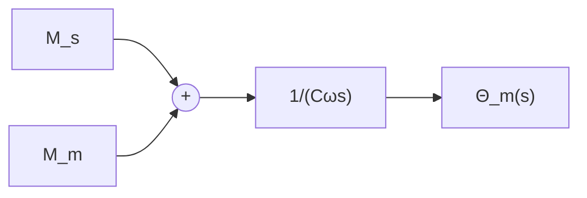
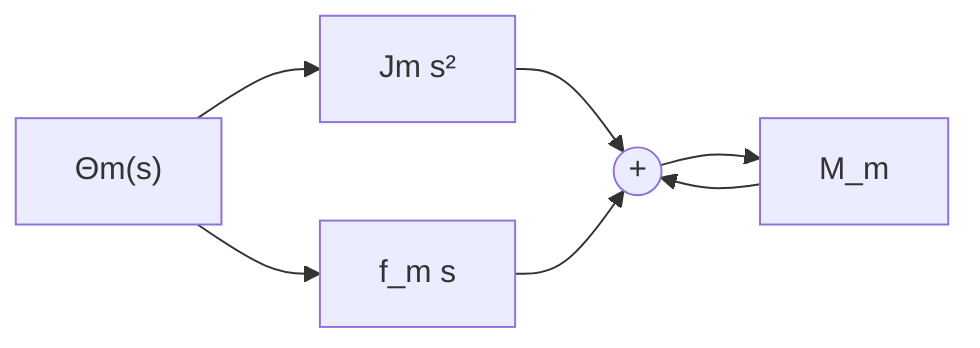

# 2. 结构图的等效变换和简化

由控制系统的结构图通过等效变换(或简化)可以方便地求取闭环系统的传递函数或系统输出量的响应。实际上, 这个过程对应于由元部件运动方程消去中间变量求取系统传递函数的过程。例如, 在例 2-10 中, 由两相伺服电动机三个方程式消去中间变量 $M_{m}$ 及 $M_{s}$ 得到传递函数 $\Theta_{m}(s)/U_{a}(s)$ 的过程, 对应于将图 2-23(h) 虚线内的四个方框简化为图 2-23(i) 中一个方框的过程。

  
(a)

  
(b)

flowchart

(c)

  
(d)

flowchart

(e)

  
(f)

(g)   

flowchart

