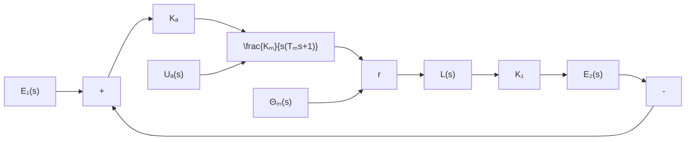

(h)

flowchart

(i)   
图 2-23 电压测量装置系统结构图

一个复杂的系统结构图,其方框间的连接必然是错综复杂的,但方框间的基本连接方式只有串联、并联和反馈连接三种。因此,结构图简化的一般方法是移动引出点或比较点,交换比较点,进行方框运算将串联、并联和反馈连接的方框合并。在简化过程中应遵循变换前后变量关系保持等效的原则,具体而言,就是变换前后前向通路中传递函数的乘积应保持不变,回路中传递函数的乘积应保持不变。
