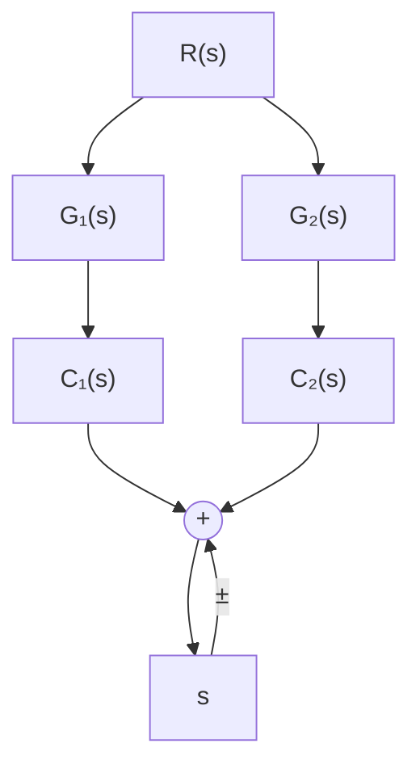

# (2) 并联方框的简化(等效)

传递函数分别为 $G_{1}(s)$ 和 $G_{2}(s)$ 的两个方框，如果它们有相同的输入量，而输出量等于两个方框输出量的代数和，则 $G_{1}(s)$ 与 $G_{2}(s)$ 称为并联连接，如图 2-25(a) 所示。

由图 2-25(a)，有

$$C _ {1} (s) = G _ {1} (s) R (s), \quad C _ {2} (s) = G _ {2} (s) R (s), \quad C (s) = C _ {1} (s) \pm C _ {2} (s)$$

由上述三式消去 $C_1(s)$ 和 $C_2(s)$ ，得

$$C (s) = \left[ G _ {1} (s) \pm G _ {2} (s) \right] R (s) = G (s) R (s) \tag {2-72}$$

式中， $G(s) = G_{1}(s)\pm G_{2}(s)$ ，是并联方框的等效传递函数，可用图2-25(b)的方框表示。由此可知，两个方框并联连接的等效方框，等于各个方框传递函数的代数和。这个结论可推广到 $\pmb{n}$ 个并联连接的方框情况。

flowchart

(a)

flowchart

(b)   
图 2-25 方框并联连接及其简化
