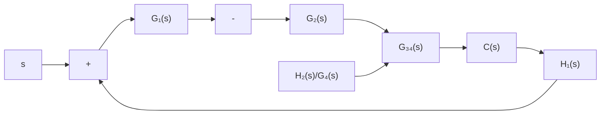
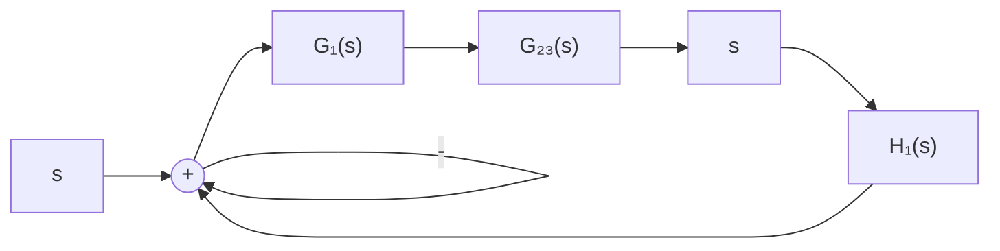

例 2-11 试简化图 2-27 系统结构图, 并求系统传递函数 $C(s)/R(s)$ 。  


<details>
<summary>flowchart</summary>

```mermaid
graph LR
    R["R(s)"] --> Sum1((+))
    Sum1 --> G1["G₁(s)"]
    G1 --> Sum2((-))
    Sum2 --> G2["G₂(s)"]
    G2 --> Sum3((+))
    Sum3 --> G3["G₃(s)"]
    G3 --> G4["G₄(s)"]
    G4 --> C["C(s)"]
    C --> H1["H₁(s)"]
    H1 --> Sum1
    H2["H₂(s)"] --> G2
    H3["H₃(s)"] --> G3
    H2 --> G4
    H3 --> G3
    G1 --> Sum2
    G2 --> Sum3
    G3 --> Sum4
```
</details>

图 2-27 例 2-11 系统结构图

解 在图中, 若不移动比较点或引出点的位置就无法进行方框的等效运算。为此, 首先应用表2-1的规则(8), 将 $G_{3}(s)$ 与 $G_{4}(s)$ 两方框之间的引出点后移到 $G_{4}(s)$ 方框的输出端(注意, 不宜前移), 如图2-28(a)所示。其次, 将 $G_{3}(s), G_{4}(s)$ 和 $H_{3}(s)$ 组成的内反馈回路简化, 其等效传递函数为

$$G _ {3 4} (s) = \frac {G _ {3} (s) G _ {4} (s)}{1 + G _ {3} (s) G _ {4} (s) H _ {3} (s)}$$

如图2-28(b)所示。然后，再将 $G_{2}(s), G_{34}(s), H_{2}(s)$ 和 $1 / G_{4}(s)$ 组成的内反馈回路简化，其等效传递函数为

$$G _ {2 3} (s) = \frac {G _ {2} (s) G _ {3} (s) G _ {4} (s)}{1 + G _ {3} (s) G _ {4} (s) H _ {3} (s) + G _ {2} (s) G _ {3} (s) H _ {2} (s)}$$

如图 2-28(c) 所示。最后，将 $G_{1}(s)$ , $G_{23}(s)$ 和 $H_{1}(s)$ 组成的反馈回路简化便求得系统的传递函数

$$
\begin{array}{l} \Phi (s) = \frac {C (s)}{R (s)} \\ = \frac {G _ {1} (s) G _ {2} (s) G _ {3} (s) G _ {4} (s)}{1 + G _ {2} (s) G _ {3} (s) H _ {2} (s) + G _ {3} (s) G _ {4} (s) H _ {3} (s) + G _ {1} (s) G _ {2} (s) G _ {3} (s) G _ {4} (s) H _ {1} (s)} \\ \end{array}
$$


<details>
<summary>flowchart</summary>

```mermaid
graph LR
    R["s"] --> O((+))
    O --> G1["G₁(s)"]
    G1 --> O
    O --> G2["G₂(s)"]
    G2 --> O
    O --> G3["G₃(s)"]
    G3 --> G4["G₄(s)"]
    G4 --> C["C(s)"]
    C --> H1["H₁(s)"]
    H1 --> O
    H2["H₂(s)"] --> G4
    H3["H₃(s)"] --> G3
    G4 --> H2
    G3 --> H3
    H2 --> G4
    H3 --> G1
    G4 -->|1/(G₄(s))| G2
    G2 -->|-| O
    O -->|-| O
```
</details>

(a)


<details>
<summary>flowchart</summary>


</details>

(b)


<details>
<summary>flowchart</summary>


</details>

(c)   
图 2-28 例 2-11 系统结构图简化
