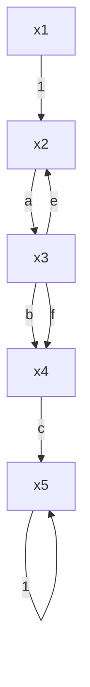

# 3. 信号流图的组成及性质

信号流图起源于梅森利用图示法来描述一个或一组线性代数方程式,它是由节点和支路组成的一种信号传递网络。图中节点代表方程式中的变量,以小圆圈表示;支路是连接两个节点的定向线段,用支路增益表示方程式中两个变量的因果关系,因此支路相当于乘法器。

图 2-31(a) 是有两个节点和一条支路的信号流图, 其中两个节点分别代表电流 I 和电压 U,支路增益是电阻 $R$ 。该图表明，电流 $I$ 沿支路传递并增大 $R$ 倍而得到电压 $U$ ，即 $U = IR$ ，这正是众所熟知的欧姆定律，它决定了通过电阻 $R$ 的电流与电压间的定量关系，如图2-31(b)所示。图2-32是由五个节点和八条支路组成的信号流图，图中五个节点分别代表 $x_{1}, x_{2}, x_{3}, x_{4}$ 和 $x_{5}$ 五个变量，每条支路增益分别是 $a, b, c, d, e, f, g$ 和1。由图可以写出描述五个变量因果关系的一组代数方程式：

$$x _ {1} = x _ {1}, \quad x _ {2} = x _ {1} + e x _ {3}, \quad x _ {3} = a x _ {2} + f x _ {4}x _ {4} = b x _ {3}, \quad x _ {5} = d x _ {2} + c x _ {4} + g x _ {5}$$

上述每个方程式左端的变量取决于右端有关变量的线性组合。一般，方程式右端的变量作为原因，左端的变量作为右端变量产生的效果，这样，信号流图便把各个变量之间的因果关系贯通了起来。

  
图2-31 欧姆定律与信号流图

flowchart

图 2-32 典型的信号流图

至此，信号流图的基本性质可归纳如下：

1) 节点标志系统的变量。一般，节点自左向右顺序设置，每个节点标志的变量是所有流向该节点的信号之代数和，而从同一节点流向各支路的信号均用该节点的变量表示。例如，图2-32中，节点 $x_{3}$ 标志的变量是来自节点 $x_{2}$ 和节点 $x_{4}$ 的信号之和，它同时又流向节点 $x_{4}$ 。  
2) 支路相当于乘法器, 信号流经支路时, 被乘以支路增益而变换为另一信号。例如, 图 2-32 中, 来自节点 $x_{2}$ 的变量被乘以支路增益 $a$ , 来自节点 $x_{4}$ 的变量被乘以支路增益 $f$ , 自节点 $x_{3}$ 流向节点 $x_{4}$ 的变量被乘以支路增益 $b$ 。  
3）信号在支路上只能沿箭头单向传递，即只有前因后果的因果关系。  
4）对于给定的系统，节点变量的设置是任意的，因此信号流图不是唯一的。

在信号流图中，常使用以下名词术语：

源节点(或输入节点) 在源节点上, 只有信号输出的支路(即输出支路), 而没有信号输入的支路(即输入支路), 它一般代表系统的输入变量, 故也称输入节点。图 2-32 中的节点 $x_{1}$ 就是源节点。

阱节点(或输出节点) 在阱节点上, 只有输入支路而没有输出支路, 它一般代表系统的输出变量, 故也称输出节点。图 2-31 中的节点 U 就是阱节点。

混合节点 在混合节点上,既有输入支路又有输出支路。图 2-32 中的节点 $x_{2}, x_{3}, x_{4}, x_{5}$ 均是混合节点。若从混合节点引出一条具有单位增益的支路,可将混合节点变为阱节点,成为系统的输出变量,如图 2-32 中用单位增益支路引出的节点 $x_{5}$ 。

前向通路 信号从输入节点到输出节点传递时,每个节点只通过一次的通路,叫前向通路。前向通路上各支路增益之乘积,称前向通路总增益,一般用 $p_k$ 表示。在图2-32中,从源节点 $x_1$ 到阱节点 $x_5$ ,共有两条前向通路:一条是 $x_1 \to x_2 \to x_3 \to x_4 \to x_5$ ,其前向通路总增益 $p_1 = abc$ ;另一条是 $x_1 \to x_2 \to x_5$ ,其前向通路总增益 $p_2 = d$ 。

回路 起点和终点在同一节点,而且信号通过每一节点不多于一次的闭合通路称为单独回路，简称回路。回路中所有支路增益之乘积叫回路增益，用 $L_{a}$ 表示。在图2-32中共有三个回路：一个是起于节点 $x_{2}$ ，经过节点 $x_{3}$ 最后回到节点 $x_{2}$ 的回路，其回路增益 $L_{1} = ae$ ；第二个是起于节点 $x_{3}$ ，经过节点 $x_{4}$ 最后回到节点 $x_{3}$ 的回路，其回路增益 $L_{2} = bf$ ；第三个是起于节点 $x_{5}$ 并回到节点 $x_{5}$ 的自回路，其回路增益是 $g$ 。

不接触回路 回路之间没有公共节点时,这种回路叫不接触回路。在信号流图中,可以有两个或两个以上不接触的回路。在图2-32中,有两对不接触的回路: 一对是 $x_{2}\rightarrow x_{3}\rightarrow x_{2}$ 和 $x_{5}\rightarrow x_{5}$ ; 另一对是 $x_{3}\rightarrow x_{4}\rightarrow x_{3}$ 和 $x_{5}\rightarrow x_{5}$ 。
