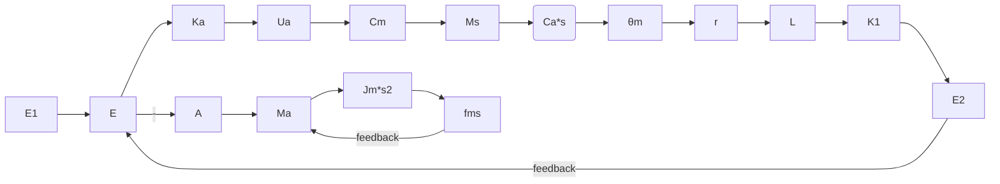
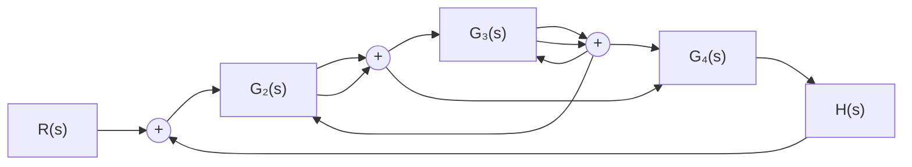
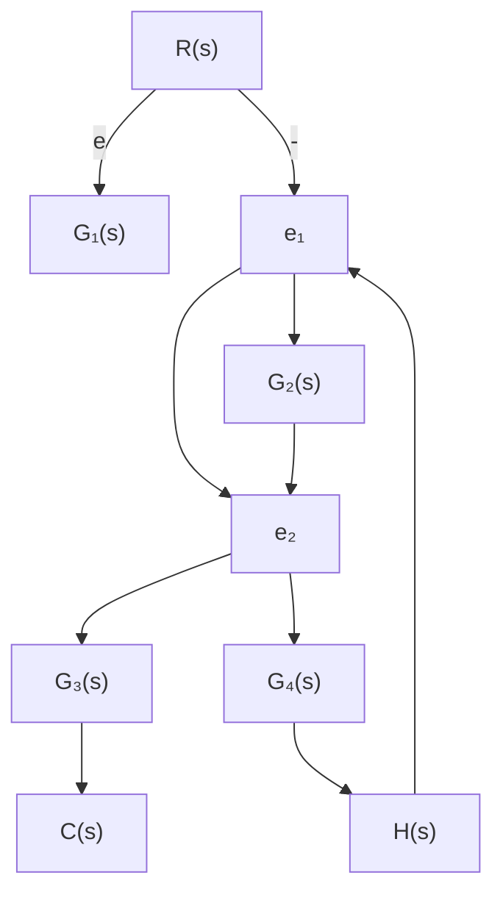

# (2) 由系统结构图绘制信号流图

在结构图中,由于传递的信号标记在信号线上,方框则是对变量进行变换或运算的算子。因此,从系统结构图绘制信号流图时,只需在结构图的信号线上用小圆圈标志出传递的信号,便得到节点;用标有传递函数的线段代替结构图中的方框,便得到支路,于是,结构图也就变换为相应的信号流图了。例如,由图2-23(h)的结构图绘制信号流图的过程示于图2-33(a)、(b)中。


<details>
<summary>flowchart</summary>


</details>

(a)


<details>
<summary>flowchart</summary>

```mermaid
graph LR
    E1 -->|1| E
    E -->|K0| Uo
    Uo --> Cm
    Cm -->|1/(Cm)s| R
    R --> L
    L --> K1
    K1 --> E2
    E2 -->|-1| E
    E -->|Mx| Mm
    Mm -->|-1| E
    Mm -->|Jmr s^2| R
    R -->|θm| Mm
    Mm -->|fmr s| R
```
</details>

(b)   
图 2-33 由结构图绘制信号流图的过程

从系统结构图绘制信号流图时应尽量精简节点的数目。例如，支路增益为1的相邻两个节点，一般可以合并为一个节点，但对于源节点或阱节点却不能合并掉。例如，图2-33(b)中的节点 $M_{s}$ 和节点 $M_{m}$ 可以合并成一个节点，其变量是 $M_{s}-M_{m}$ ；但源节点 $E_{1}$ 和节点E却不允许合并。又例如，在结构图比较点之前没有引出点(但在比较点之后可以有引出点)时，只需在比较点后设置一个节点便可，如图2-34(a)所示；但若在比较点之前有引出点时，就需在引出点和比较点各设置一个节点，分别标志两个变量，它们之间的支路增益是1，如图2-34(b)所示。

  
图 2-34 比较点与节点对应关系

例 2-13 试绘制图 2-35 所示系统结构图对应的信号流图。


<details>
<summary>flowchart</summary>


</details>

图 2-35 例 2-13 系统的结构图

解 首先, 在系统结构图的信号线上, 用小圆圈标注各变量对应的节点, 如图 2-36(a) 所示。其次, 将各节点按原来顺序自左向右排列, 连接各节点的支路与结构图中的方框相对应, 即将结构图中的方框用具有相应增益的支路代替, 并连接有关的节点, 便得到系统的信号流图, 如图 2-36(b) 所示。


<details>
<summary>flowchart</summary>


</details>

(a)


<details>
<summary>flowchart</summary>

```mermaid
graph LR
    R["R(s)"] -->|1| e["e"]
    e --> G1["G₁(s)"]
    G1 --> e1["e₁"]
    e1 --> G2["G₂(s)"]
    G2 --> e2["e₂"]
    e2 --> G3["G₃(s)"]
    G3 --> C["C(s)"]
    e1 -->|−H(s)| e1
    e2 -->|G₄(s)| C
```
</details>

(b)   
图 2-36 例 2-13 系统的信号流图
