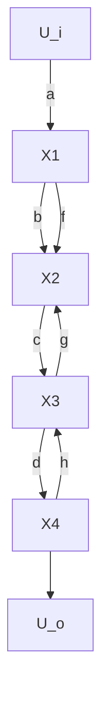

# 5. 梅森增益公式

从一个复杂的系统信号流图上,经过简化可以求出系统的传递函数,而且,结构图的等效变换规则亦适用于信号流图的简化,但这个过程毕竟还是很麻烦的。控制工程中常应用梅森(Mason)增益公式直接求取从源节点到阱节点的传递函数,而不需简化信号流图,这就为信号流图的广泛应用提供了方便。当然,由于系统结构图与信号流图之间有对应关系,梅森增益公式也可直接用于系统结构图。

梅森增益公式的来源是按克莱姆(Gramer)规则求解线性联立方程式组时,将解的分子多项式及分母多项式与信号流图(即拓扑图)巧妙联系的结果。

在图 2-37 的典型信号流图中, 变量 $U_{i}$ 和 $U_{o}$ 分别用源节点 $U_{i}$ 和阱节点 $U_{o}$ 表示, 由图可得相应的一组代数方程式为

flowchart

图 2-37 典型信号流图

$$X _ {1} = a U _ {i} + f X _ {2}X _ {2} = b X _ {1} + g X _ {3}X _ {3} = c X _ {2} + h X _ {4}X _ {4} = d X _ {3} + e U _ {i}U _ {o} = X _ {4}$$

经整理后得

$$X _ {1} - f X _ {2} = a U _ {i}b X _ {1} - X _ {2} + g X _ {3} = 0c X _ {2} - X _ {3} + h X _ {4} = 0- d X _ {3} + X _ {4} = e U _ {i}$$

现在用克莱姆规则求上述方程组的解 $X_{4}$ （即变量 $U_{o}$ ），并进而求出系统的传递函数 $U_{o} / U_{i}$ 。由克莱姆规则，方程式组的系数行列式为

$$
\Delta = \left| \begin{array}{c c c c} 1 & - f & 0 & 0 \\ b & - 1 & g & 0 \\ 0 & c & - 1 & h \\ 0 & 0 & - d & 1 \end{array} \right| = 1 - d h - g c - f b + f b d h \tag {2-75}

\Delta_ {4} = \left| \begin{array}{c c c c} 1 & - f & 0 & a U _ {i} \\ b & - 1 & g & 0 \\ 0 & c & - 1 & 0 \\ 0 & 0 & - d & e U _ {i} \end{array} \right| = a b c d U _ {i} + e U _ {i} (1 - g c - b f) \tag {2-76}
$$

因此， $X_{4} = U_{o} = \Delta_{4} / \Delta$ ，即有

$$\frac {U _ {o}}{U _ {i}} = \frac {X _ {4}}{U _ {i}} = \frac {a b c d + e (1 - g c - b f)}{1 - d h - g c - f b + f b d h} \tag {2-77}$$

对上述传递函数的分母多项式及分子多项式进行分析后,可以得到它们与系数行列式 $\Delta,\Delta_{4}$ 及信号流图之间的巧妙联系。首先可以发现,传递函数的分母多项式即是系数行列式 $\Delta$ ,而且其中包含有信号流图中的三个单独回路增益之和项,即 $-(fb+gc+dh)$ ,以及两个不接触的回路增益之乘积项, 即 $fbdh$ 。这个特点可以用信号流图的名词术语写成如下形式:

$$\Delta = 1 - \sum L _ {a} + \sum L _ {b} L _ {c} \tag {2-78}$$

式中， $\sum L_{a}$ 表示信号流图中所有单独回路的回路增益之和项，即 $\sum L_{a} = fb + gc + dh$ ； $\sum L_{b}L_{c}$ 表示信号流图中每两个互不接触的回路增益之乘积的和项，即 $\sum L_{b}L_{c} = fbdh$ 。其次可以看到，传递函数的分子多项式与系数行列式 $\Delta_{4}$ 相对应，而且其中包含有两条前向通路总增益之和项，即 $abcd + e$ ，以及与前向通路 $e$ 不接触的两个单独回路的回路增益与该前向通路总增益之乘积的和项，即 $-(gce + bfe)$ 。这个特点也可以用信号流图的名词术语写成如下形式：

$$\frac {\Delta_ {4}}{U _ {i}} = \sum_ {k = 1} ^ {2} p _ {k} - \sum_ {i = 2} p _ {i} L _ {i} \tag {2-79}$$
