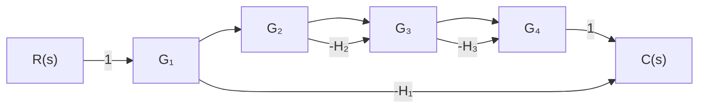

式中， $p_{k}$ 是第 k 条前向通路总增益，本例中共有两条前向通路，故 $\sum p_{k}=p_{1}+p_{2}=abcd+e;L_{i}$ 为与第 i 条前向通路不接触回路的回路增益，本例中有两个回路与第二条前向通路不接触，故 $\sum p_{2}L_{2}=gce+bfe$ 。进一步分析还可以发现 $L_{i}$ 与系数行列式 $\Delta$ 之间有着微妙的联系，即 $L_{i}$ 是系数行列式 $\Delta$ 中与第 i 条前向通路不接触的所有回路的回路增益项。例如，第二条前向通路 e 与回路增益为 gc 和 bf 的两个回路均不接触，它正好是系数行列式 $\Delta$ 中的两项 $-(gc+fb)$ 。若前向通路与所有回路都接触时，则 $L_{i}=0$ 。现令 $\Delta_{i}=1-L_{i}$ ，则传递函数分子多项式还可进一步简记为

$$\frac {\Delta_ {4}}{U _ {i}} = \sum_ {k = 1} ^ {2} p _ {k} \Delta_ {k} \tag {2-80}$$

式中， $\Delta_k$ 是与第 $k$ 条前向通路对应的余因子式，它等于系数行列式 $\Delta$ 中，去掉与第 $k$ 条前向通路接触的所有回路的回路增益项后的余项式。本例中， $k = 1$ 时， $p_1 = abcd, \Delta_1 = 1; k = 2$ 时， $p_2 = e, \Delta_2 = 1 - gc - bf$ 。于是，使用信号流图的名词术语后，式(2-77)系统传递函数可写为

$$\frac {U _ {o}}{U _ {i}} = \frac {p _ {1} \Delta_ {1} + p _ {2} \Delta_ {2}}{\Delta} = \frac {1}{\Delta} \sum_ {k = 1} ^ {2} p _ {k} \Delta_ {k} \tag {2-81}$$

该述表达式建立了信号流图的某些特征量(如前向通路总增益、回路增益等)与系统传递函数(或输出量)之间的直观联系,这就是梅森增益公式的雏形。根据这个公式,可以从信号流图上直接写出从源节点到阱节点的传递函数的输出量表达式。

推而广之,具有任意条前向通路及任意个单独回路和不接触回路的复杂信号流图,求取从任意源节点到任意阱节点之间传递函数的梅森增益公式记为

$$P = \frac {1}{\Delta} \sum_ {k = 1} ^ {n} p _ {k} \Delta_ {k} \tag {2-82}$$

式中， $P$ 为从源节点到阱节点的传递函数（或总增益）； $n$ 为从源节点到阱节点的前向通路总数； $p_k$ 为从源节点到阱节点的第 $k$ 条前向通路总增益； $\Delta$ 为 $1 - \sum L_a + \sum L_bL_c - \sum L_dL_eL_f + \cdots$ 称为流图特征式，其中 $\sum L_a$ 为所有单独回路增益之和； $\sum L_bL_c$ 为所有互不接触的单独回路中，每次取其中两个回路的回路增益的乘积之和； $\sum L_dL_eL_f$ 为所有互不接触的单独回路中，每次取其中三个回路的回路增益的乘积之和； $\Delta_k$ 为流图余因子式，它等于流图特征式中除去与第 $k$ 条前向通路相接触的回路增益项（包括回路增益的乘积项）以后的余项式。

例 2-14 试用梅森公式求例 2-11 系统的传递函数 $C(s)/R(s)$ 。

解 在系统结构图中使用梅森公式时,应特别注意区分不接触回路。为便于观察,将与图 2-27 的系统结构图对应的信号流图绘于图 2-38 中。由图可见,从源节点 R 到阱节点 C 有一条前向通路,其总增益 $^{①}$ $p_{1}=G_{1}G_{2}G_{3}G_{4}$ ;有三个单独回路,回路增益分别是 $L_{1}=-G_{2}G_{3}H_{2}$ , $L_{2}=-G_{3}G_{4}H_{3}$ , $L_{3}=-G_{1}G_{2}G_{3}G_{4}H_{1}$ ;没

flowchart

图 2-38 与图 2-27 对应的信号流图

有不接触回路，且前向通路与所有回路均接触，故余因子式 $\Delta_1 = 1$ 。因此，由梅森增益公式求得系统传递函数为

$$\frac {C (s)}{R (s)} = P _ {R C} = \frac {1}{\Delta} p _ {1} \Delta_ {1} = \frac {G _ {1} G _ {2} G _ {3} G _ {4}}{1 + G _ {1} G _ {2} G _ {3} G _ {4} H _ {1} + G _ {2} G _ {3} H _ {2} + G _ {3} G _ {4} H _ {3}}$$
