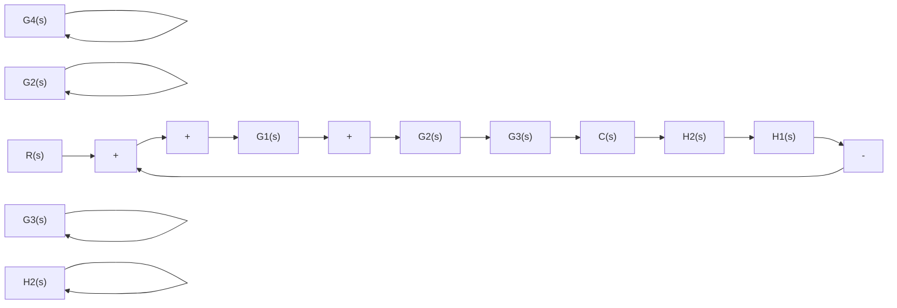
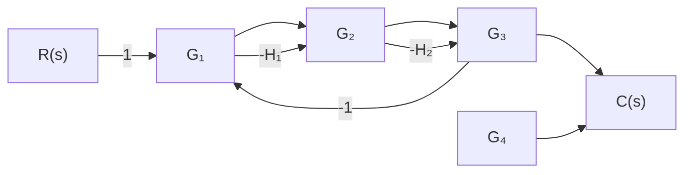
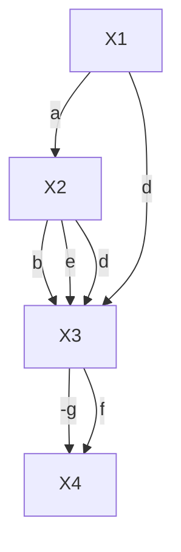

显然，上述结果与例 2-11 用结构图变换所得结果相同。

例 2-15 求图 2-39 所示系统的传递函数 $C(s)/R(s)$ 。

flowchart

(a)

flowchart

(b)   
图 2-39 例 2-15 系统结构图(a)和信号流图(b)

解 从信号流图可见,由源节点 R 到阱节点 C 有两条前向通路,即 n=2,且 $p_{1}=G_{1}G_{2}G_{3}$ , $p_{2}=G_{1}G_{4}$ ;有五个单独回路,即 $L_{1}=-G_{1}G_{2}H_{1},L_{2}=-G_{2}G_{3}H_{2},L_{3}=-G_{1}G_{2}G_{3},L_{4}=-G_{4}H_{2},L_{5}=-G_{1}G_{4}$ ;没有不接触回路,且所有回路均与两条前向通路接触,因此 $\Delta_{1}=\Delta_{2}=1$ ,而 $\Delta=1-(L_{1}+L_{2}+L_{3}+L_{4}+L_{5})$ 。故由梅森公式求得系统传递函数为

$$
\begin{array}{l} \frac {C (s)}{R (s)} = \frac {1}{\Delta} (p _ {1} \Delta_ {1} + p _ {2} \Delta_ {2}) \\ = \frac {G _ {1} G _ {2} G _ {3} + G _ {1} G _ {4}}{1 + G _ {1} G _ {2} H _ {1} + G _ {2} G _ {3} H _ {2} + G _ {1} G _ {2} G _ {3} + G _ {4} H _ {2} + G _ {1} G _ {4}} \\ \end{array}
$$

例 2-16 试求图 2-40 系统信号流图的传递函数 $X_{4}/X_{1}$ 及 $X_{2}/X_{1}$ 。

解 现用梅森增益公式求对应于同一个源节点 $X_{1}$ 和不同阱节点的两路传递函数。值得指出，对于给定的系统信号流图(或结构图)，梅森增益公式中的特征式 $\Delta$ 是确定不变的，只是对于不同的源节点和阱节点，其前向通路和余因子式是不同的。本例中，有三个单独回路，即 $\sum L_{a} = -d - eg - bcg$ ；有两个互不接触回路，即 $\sum L_{b}L_{c} = deg$ 。信号流图特征式 $\Delta = 1 - \sum L_{a} + \sum L_{b}L_{c} = 1$ $+d+eg+bcg+deg$ 。从源节点 $X_{1}$ 到阱节点 $X_{4}$ 的前向通路有两条，其前向通路总增益分别是 $p_{1}=aef, p_{2}=abcf$ 。其中第一条前向通路与回路-d不接触，故 $\Delta_{1}=1+d$ ；第二条前向通路与所有回路都接触，故 $\Delta_{2}=1$ 。由此求得从源节点 $X_{1}$ 到阱节点 $X_{4}$ 的传递函数为

flowchart

图 2-40 例 2-16 信号流图

$$\frac {X _ {4}}{X _ {1}} = \frac {1}{\Delta} (p _ {1} \Delta_ {1} + p _ {2} \Delta_ {2}) = \frac {a e f (1 + d) + a b c f}{1 + d + e g + b c g + d e g}$$
