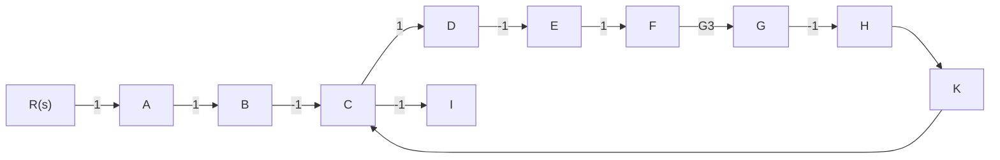

另外，从源节点 $X_{1}$ 到阱节点 $X_{2}$ 的前向通路有一条，其总增益 $p_1 = a$ ，且与回路 $-d$ 不接触，故 $\Delta_1 = 1 + d$ 。于是求得从源节点 $X_{1}$ 到阱节点 $X_{2}$ 的传递函数为

$$\frac {X _ {2}}{X _ {1}} = \frac {1}{\Delta} p _ {1} \Delta_ {1} = \frac {a (1 + d)}{1 + d + e g + b c g + d e g}$$

例 2-17 试求图 2-41 信号流图中的传递函数 $C(s)/R(s)$ 。

flowchart

图 2-41 例 2-17 的信号流图

解 本例中,单独回路有四个,即

$$\sum L _ {a} = - G _ {1} - G _ {2} - G _ {3} - G _ {1} G _ {2}$$

两个互不接触的回路有四组，即

$$\sum L _ {b} L _ {c} = G _ {1} G _ {2} + G _ {1} G _ {3} + G _ {2} G _ {3} + G _ {1} G _ {2} G _ {3}$$

三个互不接触的回路有一组，即

$$\sum L _ {d} L _ {e} L _ {f} = - G _ {1} G _ {2} G _ {3}$$

于是，信号流图特征式为

$$
\begin{array}{l} \Delta = 1 - \sum L _ {a} + \sum L _ {b} L _ {c} - \sum L _ {d} L _ {e} L _ {f} \\ = 1 + G _ {1} + G _ {2} + G _ {3} + 2 G _ {1} G _ {2} + G _ {1} G _ {3} + G _ {2} G _ {3} + 2 G _ {1} G _ {2} G _ {3} \\ \end{array}
$$

从源节点 R 到阱节点 C 的前向通路共有四条, 其前向通路总增益以及余因子式分别为

$$
\begin{array}{l} p _ {1} = G _ {1} G _ {2} G _ {3} K, \quad \Delta_ {1} = 1 \\ p _ {2} = G _ {2} G _ {3} K, \quad \Delta_ {2} = 1 + G _ {1} \\ p _ {3} = G _ {1} G _ {3} K, \quad \Delta_ {3} = 1 + G _ {2} \\ p _ {4} = - G _ {1} G _ {2} G _ {3} K, \quad \Delta_ {4} = 1 \\ \end{array}
$$

因此，由梅森公式求得系统传递函数为

$$
\begin{array}{l} \frac {C (s)}{R (s)} = \frac {p _ {1} \Delta_ {1} + p _ {2} \Delta_ {2} + p _ {3} \Delta_ {3} + p _ {4} \Delta_ {4}}{\Delta} \\ = \frac {G _ {2} G _ {3} K (1 + G _ {1}) + G _ {1} G _ {3} K (1 + G _ {2})}{1 + G _ {1} + G _ {2} + G _ {3} + 2 G _ {1} G _ {2} + G _ {1} G _ {3} + G _ {2} G _ {3} + 2 G _ {1} G _ {2} G _ {3}} \\ \end{array}
$$
